# CDC Bridge

**CDC Bridge** — это система для отслеживания изменений данных (Change Data Capture) в различных источниках данных и доставки уведомлений о этих изменениях во внешние системы. Проект предоставляет гибкую архитектуру для мониторинга изменений в базах данных и интеграции с различными сервисами через настраиваемые каналы доставки.

## 🎯 Назначение

Система предназначена для:
- **Отслеживания изменений** в таблицах баз данных в реальном времени
- **Фильтрации событий** по заданным критериям
- **Трансформации данных** перед отправкой получателям
- **Доставки уведомлений** через различные каналы (webhooks, Kafka, и др.)
- **Журналирования и аудита** всех обработанных событий

## 🏗️ Архитектура системы

```plantuml
@startuml CDC Bridge Architecture

!define RECTANGLE class

package "CDC Bridge Core" {

RECTANGLE CdcBridgeContext {
+RegisterSource(ICdcSource)
+RegisterFilter(IFilter)
+RegisterTransformer(ITransformer)
+RegisterReceiver(IReceiver)
+GetConfiguration()
--
-sources: List<ICdcSource>
-filters: List<IFilter>
-transformers: List<ITransformer>
-receivers: List<IReceiver>
}

interface ICdcSource {
+GetChanges(trackingInstance, lastRowNumber): TrackedChange[]
+CheckCdcIsEnabled(trackingInstance): bool
+AddTrackingInstance(trackingInstance)
}

interface IFilter {
+Name: string
+IsMatch(trackedChange, parameters): bool
}

interface ITransformer {
+Name: string
+Transform(trackedChange, parameters): JsonElement
}

interface IReceiver {
+Name: string
+SendAsync(trackedChange, parameters): ReceiverProcessResult
}

interface ICdcBridgeStorage {
+GetConfiguration(): CdcBridgeConfiguration
+SaveConfiguration(configuration)
+GetLastProcessedRowNumber(trackingInstance): string
+SaveLastProcessedRowNumber(trackingInstance, rowNumber)
+AddChangeDataEventsLogs(changes[])
+UpdateChangeDataEventsLogs(changes[])
}

interface ITrackingInstanceService {
+StartTracking(trackingInstance)
+StopTracking(trackingInstance)
+IsTracking(trackingInstance): bool
}
}

package "Models" {
RECTANGLE TrackedChange {
+ChangeType: enum
+TrackingInstance: string
+CreatedAt: DateTime
+Data: ChangeData
}

RECTANGLE ChangeData {
+Old: JsonElement?
+New: JsonElement?
+TransformedData: JsonElement?
}

enum ChangeType {
Insert
Update
Delete
}

RECTANGLE ChangeDataEvent {
+Id: Guid
+CreatedAt: DateTime
+TrackedChange: TrackedChange
+TransformedChange: JsonElement
+TrackingInstance: string
+ReceiverName: string
+FilterName: string?
+TransformerName: string?
+ProcessResult: ReceiverProcessResult?
}

RECTANGLE ReceiverProcessResult {
+Status: ReceiverProcessStatus
+ErrorDescription: string?
}
}

package "Configuration Models" {
RECTANGLE CdcBridgeConfiguration {
+Connections: Connection[]
+TrackingInstances: TrackingInstance[]
+Receivers: Receiver[]
+Filters: Filter[]
+Transformers: Transformer[]
}

RECTANGLE Connection {
+Name: string
+Description: string?
+ConnectionString: string
+Type: string
+Active: bool
}

RECTANGLE TrackingInstance {
+SourceTable: string
+CapturedColumns: string[]
+Description: string?
+Connection: string
+Active: bool
+CheckIntervalInSeconds: int
}

RECTANGLE Receiver {
+Name: string
+Description: string?
+TrackingInstance: string
+Filter: string?
+Transformer: string?
+Type: string
+RetryCount: int
+Parameters: JsonElement?
}

RECTANGLE Filter {
+Name: string
+Description: string?
+TrackingInstance: string
+Type: string
+Parameters: JsonElement?
}

RECTANGLE Transformer {
+Name: string
+Description: string?
+TrackingInstance: string
+Type: string
+Parameters: JsonElement?
}
}

' Relationships
CdcBridgeContext --> ICdcBridgeStorage
CdcBridgeContext --> ICdcSource
CdcBridgeContext --> IFilter
CdcBridgeContext --> ITransformer
CdcBridgeContext --> IReceiver

ICdcSource --> TrackedChange
IFilter --> TrackedChange
ITransformer --> TrackedChange
IReceiver --> TrackedChange
IReceiver --> ReceiverProcessResult

TrackedChange --> ChangeData
TrackedChange --> ChangeType
ChangeDataEvent --> TrackedChange
ChangeDataEvent --> ReceiverProcessResult

CdcBridgeConfiguration --> Connection
CdcBridgeConfiguration --> TrackingInstance
CdcBridgeConfiguration --> Receiver
CdcBridgeConfiguration --> Filter
CdcBridgeConfiguration --> Transformer

ICdcBridgeStorage --> CdcBridgeConfiguration
ICdcBridgeStorage --> ChangeDataEvent

note right of CdcBridgeContext
Центральный контекст системы.
Управляет регистрацией компонентов
и предоставляет доступ к конфигурации.
end note

note left of ICdcSource
Источники данных CDC.
Примеры: SQL Server CDC,
PostgreSQL логические репликации,
MySQL binlog и др.
end note

note bottom of IFilter
Фильтры событий.
Типы: JsonPathFilter,
ExternalServiceFilter и др.
end note

note bottom of ITransformer
Трансформеры данных.
Типы: JSONataTransformer
и др.
end note

note bottom of IReceiver
Получатели уведомлений.
Типы: WebhookReceiver,
MyKafkaReceiver и др.
end note

@enduml
```



## 🔧 Основные компоненты

### CdcBridgeContext
Центральный контекст системы, который:
- Регистрирует и управляет всеми компонентами системы
- Предоставляет доступ к конфигурации
- Координирует взаимодействие между компонентами

### Источники данных (ICdcSource)
Интерфейс для различных источников изменений:
- **SQL Server CDC** - использует встроенные функции Change Data Capture
- **PostgreSQL** - логические репликации или триггеры
- **MySQL** - анализ binlog или триггеры
- **Oracle** - LogMiner или FlashBack Query

### Фильтры (IFilter)
Компоненты для отбора событий:
- **JsonPathFilter** - фильтрация по JsonPath выражениям
- **ExternalServiceFilter** - проверка условий через внешние API
- Возможность создания пользовательских фильтров

### Трансформеры (ITransformer)
Преобразование данных перед отправкой:
- **JSONataTransformer** - трансформации через JSONata выражения
- Поддержка пользовательских трансформеров

### Получатели (IReceiver)
Каналы доставки уведомлений:
- **WebhookReceiver** - HTTP webhooks
- **KafkaReceiver** - отправка в Apache Kafka
- **FileReceiver** - запись в файлы
- Расширяемая архитектура для новых типов

### Хранилище (ICdcBridgeStorage)
Интерфейс для:
- Хранения конфигурации системы
- Отслеживания последних обработанных позиций
- Журналирования событий и аудита

## ⚙️ Конфигурация

Система настраивается через JSON конфигурацию, включающую:

### Подключения (Connections)
```json
{
"name": "shop_application_db",
"description": "Подключение к базе данных приложения",
"type": "SqlServer",
"connectionString": "Server=localhost;Database=shop;...",
"active": true
}
```

### Экземпляры отслеживания (TrackingInstances)
```json
{
"sourceTable": "users",
"capturedColumns": ["name", "email", "status"],
"description": "Отслеживание изменений пользователей",
"connection": "shop_application_db",
"active": true,
"checkIntervalInSeconds": 20
}
```

### Фильтры (Filters)
```json
{
"name": "ActiveToInactive",
"description": "Фильтр изменений статуса пользователя",
"trackingInstance": "users",
"type": "JsonPathFilter",
"parameters": {
"expression": "$[?(@.data.old.status == 'active' && @.data.new.status == 'inactive')]"
}
}
```

### Трансформеры (Transformers)
```json
{
"name": "AnalyticsServiceTransformer",
"description": "Преобразование для аналитического сервиса",
"trackingInstance": "users",
"type": "JSONataTransformer",
"parameters": {
"transformation": "{ 'userId': data.new.id, 'displayName': data.new.name, 'isActive': data.new.status = 'active' }"
}
}
```

### Получатели (Receivers)
```json
{
"name": "AnalyticsChannel",
"description": "Отправка в сервис аналитики",
"trackingInstance": "users",
"filter": "ActiveToInactive",
"transformer": "AnalyticsServiceTransformer",
"type": "WebhookReceiver",
"retryCount": 3,
"parameters": {
"webhookUrl": "https://analytics.example.com/webhook",
"httpMethod": "POST",
"headers": {
"Authorization": "Bearer YOUR_TOKEN",
"Content-Type": "application/json"
}
}
}
```

## 🔄 Рабочий процесс

1. **Мониторинг изменений**: Источники данных периодически проверяют изменения в настроенных таблицах
2. **Создание событий**: При обнаружении изменений создаются объекты `TrackedChange`
3. **Применение фильтров**: События проходят через настроенные фильтры
4. **Трансформация данных**: Отфильтрованные события преобразуются трансформерами
5. **Доставка уведомлений**: Трансформированные данные отправляются получателям
6. **Журналирование**: Все события записываются в журнал для аудита

## 📊 Модели данных

### TrackedChange
Основная модель события изменения:
- `ChangeType` - тип изменения (Insert/Update/Delete)
- `TrackingInstance` - идентификатор источника
- `CreatedAt` - временная метка
- `Data` - данные до и после изменения

### ChangeDataEvent
Полная информация о событии для журналирования:
- Исходное событие `TrackedChange`
- Трансформированные данные
- Информация о примененных фильтрах и трансформерах
- Результат обработки получателями

## 🛠️ Технологии

- **.NET 9.0** - основная платформа
- **System.Text.Json** - сериализация JSON
- **Абстракции** - слабая связанность компонентов
- **Dependency Injection** - инверсия управления
- **Async/Await** - асинхронное программирование

## 🚀 Расширяемость

Архитектура проекта позволяет легко добавлять:
- Новые типы источников данных
- Пользовательские фильтры
- Специализированные трансформеры
- Дополнительные каналы доставки
- Альтернативные хранилища конфигурации

## 📝 Примеры использования

### Отслеживание изменений пользователей
- Мониторинг изменений статуса пользователей
- Отправка уведомлений в аналитические системы
- Синхронизация с внешними сервисами

### Аудит заказов
- Отслеживание изменений статуса заказов
- Уведомления клиентов через различные каналы
- Интеграция с системами учета

### Синхронизация данных
- Репликация критичных изменений между системами
- Обновление кэшей при изменении справочников
- Интеграция с очередями сообщений

## 📁 Структура проекта

```
src/
├── CdcBridge.Core/ # Основная библиотека
│ ├── Abstractions/ # Интерфейсы
│ ├── Models/ # Модели данных
│ │ └── Configuration/ # Модели конфигурации
│ └── CdcBridgeContext.cs # Центральный контекст
├── CDC-Bridge.sln # Solution файл
exampleConfiguration/ # Примеры конфигурации
├── settings.schema.json # JSON Schema
├── exampleSettingsFormat.json # Пример настроек
└── exampleTrackingInstanceEventData.json # Пример событий
```

---

**CDC Bridge** предоставляет надежную и масштабируемую платформу для интеграции изменений данных с внешними системами, обеспечивая гибкость конфигурации и расширяемость архитектуры.