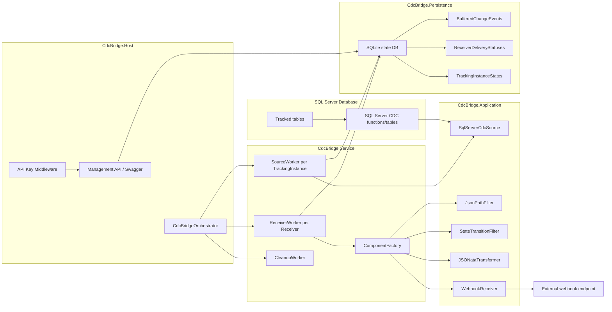
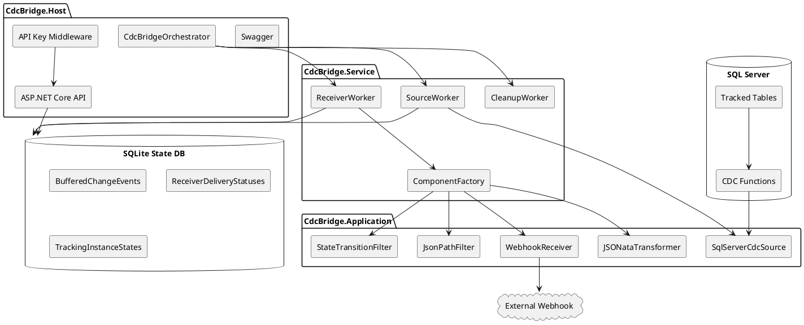
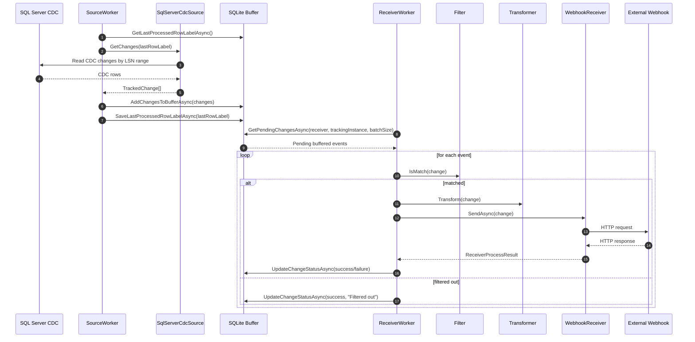
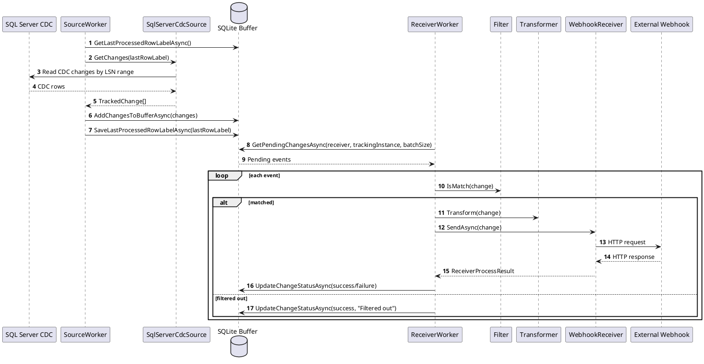
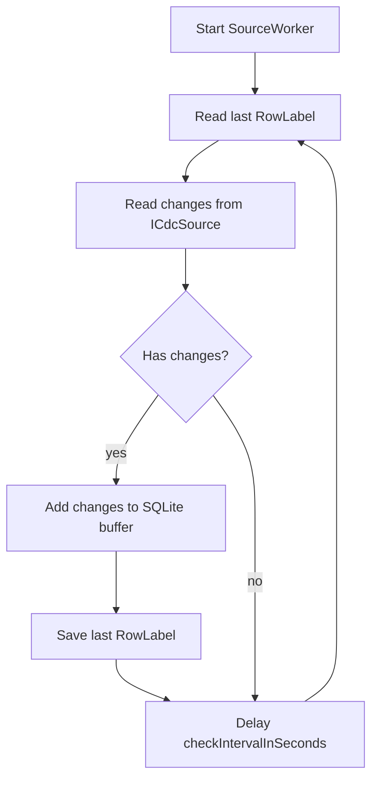
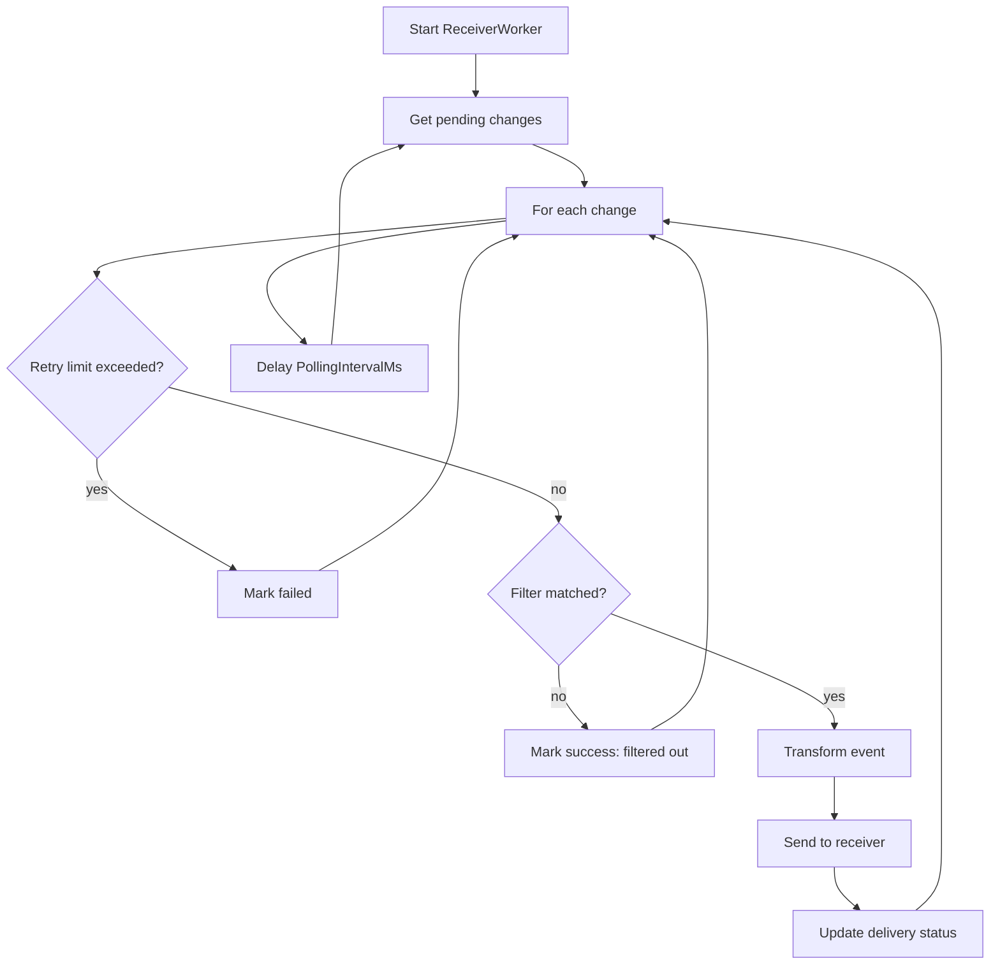
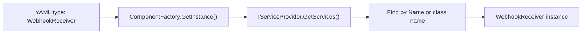
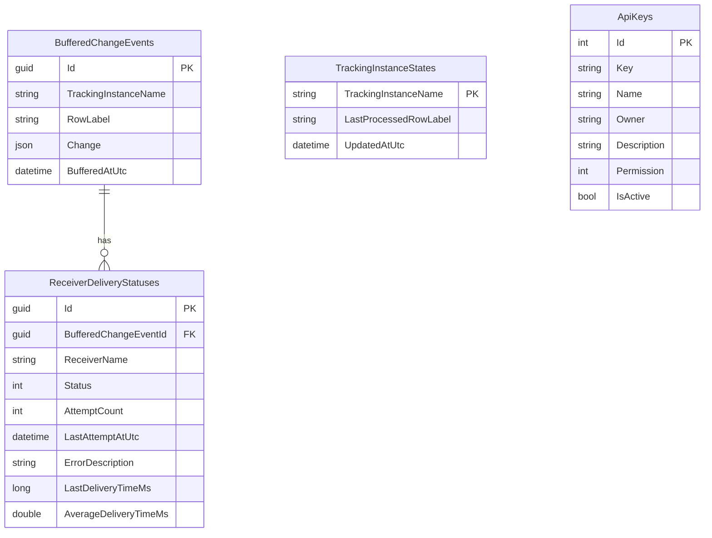
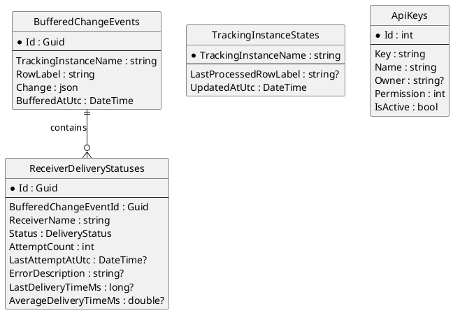

# CDC-Bridge — текущая архитектура приложения

## 1. Назначение документа

Документ описывает текущую архитектуру проекта **CDC-Bridge** по фактической структуре репозитория. Текущая версия сервиса решает задачу чтения изменений из SQL Server CDC, буферизации событий, фильтрации/трансформации и доставки в получатели, сейчас в первую очередь через webhook.

## 2. Текущая структура solution

```text
CDC-Bridge.sln
├── src
│   ├── CdcBridge.Core
│   ├── CdcBridge.Configuration
│   ├── CdcBridge.Application
│   ├── CdcBridge.Persistence
│   ├── CdcBridge.Service
│   ├── CdcBridge.Host
│   ├── CdcBridge.ApiClient
│   └── mssql-cdc/src/MsSqlCdc
├── tests
│   ├── CdcBridge.Application.Tests
│   ├── CdcBridge.Configuration.Tests
│   └── CdcBridge.Persistence.Tests
└── examples
    └── CdcBridge.Example.WebhookReceiver
```

| Проект | Ответственность |
|---|---|
| `CdcBridge.Core` | Базовые модели и интерфейсы: `ICdcSource`, `IReceiver`, `IFilter`, `ITransformer`. |
| `CdcBridge.Configuration` | YAML-модели, построение runtime-контекста, FluentValidation, cross-reference validation. |
| `CdcBridge.Application` | Реализации компонентов: SQL Server CDC source, JsonPath/StateTransition filters, JSONata transformer, Webhook receiver. |
| `CdcBridge.Persistence` | EF Core + SQLite state store: события, статусы доставки, checkpoints, API keys. |
| `CdcBridge.Service` | Runtime: orchestrator, source workers, receiver workers, cleanup worker, component factory. |
| `CdcBridge.Host` | ASP.NET Core host: API, Swagger, middleware, DI, Windows Service, запуск background services. |
| `CdcBridge.ApiClient` | Клиентская библиотека для API. |
| `MsSqlCdc` | Низкоуровневый слой работы с SQL Server CDC. |

## 3. Общая схема текущей архитектуры

### Mermaid



### PlantUML



## 4. Текущая модель конфигурации

Основная YAML-конфигурация содержит пять ключевых секций:

```yaml
connections: []
trackingInstances: []
receivers: []
filters: []
transformers: []
```

| Секция | Назначение |
|---|---|
| `connections` | Подключения к источникам данных. |
| `trackingInstances` | Описание отслеживаемых таблиц, колонок, схемы, подключения и интервала опроса. |
| `receivers` | Получатели событий. Сейчас основной сценарий — webhook. |
| `filters` | Фильтры событий: JsonPath, переходы состояний. |
| `transformers` | Преобразование события перед отправкой: JSONata. |

Пример:

```yaml
$schema: ./settings.schema.json

connections:
  - name: ExampleDbConnection
    type: SqlServer
    connectionString: Configuration("ConnectionStrings:default")
    active: true

trackingInstances:
  - name: EmployeeTracking
    sourceTable: employee
    sourceSchema: dbo
    capturedColumns:
      - id
      - first_name
      - last_name
      - email
    connection: ExampleDbConnection
    active: true
    checkIntervalInSeconds: 5

receivers:
  - name: EmployeeWebhook
    trackingInstance: EmployeeTracking
    type: WebhookReceiver
    parameters:
      webhookUrl: "http://localhost:5091/webhooks/employee"
      httpMethod: POST
      timeoutMs: 20000
```

## 5. Текущий поток обработки события

### Mermaid sequence diagram



### PlantUML sequence diagram



## 6. Runtime-компоненты

### `CdcBridgeOrchestrator`

Отвечает за:

- чтение runtime-конфигурации;
- инициализацию CDC на источнике;
- создание `SourceWorker` для каждого активного `trackingInstance`;
- создание `ReceiverWorker` для каждого receiver;
- управление остановкой воркеров через `CancellationToken`.

Текущая модель:

```text
1 active trackingInstance = 1 SourceWorker
1 receiver = 1 ReceiverWorker
```

### `SourceWorker`



### `ReceiverWorker`



### `ComponentFactory`

Текущая DI-based расширяемость:



## 7. Текущая модель хранения

### Таблицы

| Таблица | Назначение |
|---|---|
| `BufferedChangeEvents` | Буферизованные события изменений. |
| `ReceiverDeliveryStatuses` | Статусы доставки конкретного события конкретному receiver. |
| `TrackingInstanceStates` | Последний обработанный `RowLabel` по tracking instance. |
| `ApiKeys` | API-ключи для доступа к Management API. |

### Mermaid ER



### PlantUML ER



## 8. Текущие сильные стороны

- Хорошее разделение на слои.
- YAML-конфигурация.
- Наличие runtime-контекста конфигурации.
- Персистентный буфер событий.
- Независимые статусы доставки по receiver.
- Базовые фильтры и трансформеры.
- Возможность расширения через интерфейсы и DI.
- ASP.NET Core Host API.
- Swagger.
- Docker-обвязка.
- Тестовые проекты.

## 9. Текущие ограничения и риски

| Ограничение | Риск |
|---|---|
| ReceiverWorker обрабатывает события последовательно | Низкий throughput при медленных receivers. |
| SQLite используется как основной runtime store | Ограничение по конкурентной записи и масштабированию. |
| Обновление статуса доставки по одному событию | Много мелких транзакций и I/O. |
| Cursor и buffer сохраняются раздельно | Возможны дубли или пропуски при аварии между операциями. |
| Нет route-модели | Сложно гибко настраивать много получателей и разные политики доставки. |
| Нет DLQ как отдельной сущности | Сложно эксплуатировать окончательно сломанные события. |
| Нет production observability | Требуются метрики, traces, структурированные логи и domain state. |
| Нет plugin manifest/schema contribution | Пользовательские компоненты сложно валидировать и документировать. |
| Нет PostgreSQL source/Kafka/RabbitMQ/gRPC/database sinks | Текущий функционал пока ограничен SQL Server CDC + webhook. |

## 10. Вывод

Текущая архитектура является хорошей MVP-основой. Она уже демонстрирует правильные идеи: источник, буфер, получатель, фильтр, трансформер, runtime orchestration и API.

Для production нужно развить проект в сторону:

- `CdcEvent` как единой внутренней модели;
- `SourcePosition` вместо простого `RowLabel`;
- route-driven delivery;
- batch-based sinks;
- асинхронного pipeline на `IAsyncEnumerable` и `Channel`;
- production state store;
- DLQ;
- redelivery jobs;
- observability;
- админской панели;
- плагинов через NuGet;
- YAML schema generation.
