# CDC-Bridge — планируемая production-архитектура

## 1. Назначение документа

Документ описывает целевую production-архитектуру **CDC-Bridge** как расширяемой self-hosted платформы для маршрутизации и надежной доставки CDC-событий.

Целевая версия должна поддерживать:

- источники: SQL Server CDC, PostgreSQL logical replication, пользовательские sources;
- приемники: Kafka, RabbitMQ, Webhook, gRPC, SQL Server table sink, PostgreSQL table sink, ClickHouse analytics sink;
- пользовательские плагины через NuGet;
- YAML-конфигурацию с автоматически генерируемой JSON Schema;
- production observability;
- админскую панель;
- поиск событий и доставок;
- DLQ;
- redelivery/replay;
- безопасную эксплуатацию.

## 2. Главная архитектурная идея

Целевая модель:

```text
Source Connector
    ↓
Canonical Event Envelope
    ↓
Durable Operational Store
    ↓
Route Planner
    ↓
Filter → Transformer → Sink Connector
    ↓
External Systems
```

Ключевые принципы:

1. Источники и приемники являются коннекторами.
2. Все события приводятся к единому формату `CdcEvent`.
3. Доставка строится через `routes`.
4. Базовая гарантия — `at-least-once`.
5. Exactly-once effects достигаются через детерминированный `eventId` и идемпотентные sinks.
6. Runtime state и аналитика разделены.
7. Админка не должна нагружать горячий путь доставки.
8. YAML-схема генерируется из ядра и установленных плагинов.

## 3. Целевая структура solution

```text
src/
├── CdcBridge.Abstractions
├── CdcBridge.Core
├── CdcBridge.Configuration
├── CdcBridge.Runtime
├── CdcBridge.Persistence
├── CdcBridge.Host
├── CdcBridge.ManagementApi
├── CdcBridge.SchemaGeneration
├── CdcBridge.Plugin.Abstractions
├── CdcBridge.Plugin.Sdk
├── CdcBridge.PluginHost
│
├── connectors/
│   ├── CdcBridge.Connectors.SqlServer
│   ├── CdcBridge.Connectors.PostgreSql
│   ├── CdcBridge.Connectors.Kafka
│   ├── CdcBridge.Connectors.RabbitMq
│   ├── CdcBridge.Connectors.Grpc
│   ├── CdcBridge.Connectors.Webhook
│   ├── CdcBridge.Connectors.DatabaseSinks
│   └── CdcBridge.Connectors.ClickHouse
│
└── tests/
    ├── CdcBridge.Runtime.Tests
    ├── CdcBridge.Configuration.Tests
    ├── CdcBridge.Persistence.Tests
    ├── CdcBridge.PluginHost.Tests
    └── CdcBridge.IntegrationTests
```

## 4. Целевая логическая архитектура

### Mermaid

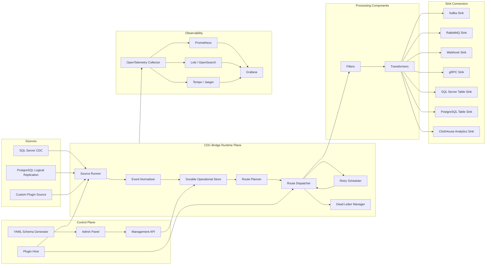

### PlantUML

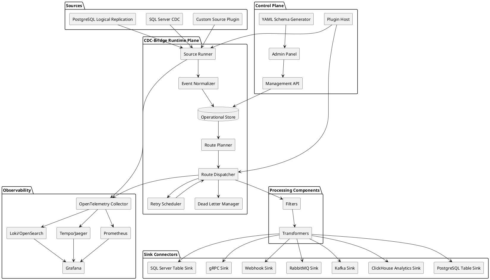

## 5. Runtime Plane и Control Plane

### Runtime Plane

Отвечает за:

- чтение CDC;
- нормализацию событий;
- запись в durable store;
- построение delivery tasks;
- фильтрацию;
- трансформацию;
- доставку в sinks;
- retry;
- DLQ;
- checkpoint-и;
- backpressure.

### Control Plane

Отвечает за:

- Management API;
- админскую панель;
- поиск событий и доставок;
- redelivery jobs;
- управление sources/routes/sinks;
- валидацию и reload конфигурации;
- установку и управление плагинами;
- генерацию YAML Schema;
- оповещения и audit log.

## 6. Canonical Event Envelope

```csharp
public sealed record CdcEvent
{
    public required string EventId { get; init; }
    public required string SourceName { get; init; }
    public required string TrackingInstanceName { get; init; }

    public required string Database { get; init; }
    public required string Schema { get; init; }
    public required string Table { get; init; }

    public required ChangeOperation Operation { get; init; }
    public required SourcePosition Position { get; init; }

    public string? TransactionId { get; init; }
    public long? TransactionSequence { get; init; }

    public DateTimeOffset? CommitTimestamp { get; init; }

    public IReadOnlyDictionary<string, object?> Key { get; init; }
        = new Dictionary<string, object?>();

    public JsonElement? Old { get; init; }
    public JsonElement? New { get; init; }

    public Dictionary<string, string> Metadata { get; init; } = new();
}
```

```csharp
public sealed record SourcePosition
{
    public required string Kind { get; init; }
    public required string Value { get; init; }
    public Dictionary<string, string> Parts { get; init; } = new();
}
```

Примеры:

```json
{
  "kind": "sqlserver-lsn",
  "value": "0000002A:000001B0:0003"
}
```

```json
{
  "kind": "postgres-wal-lsn",
  "value": "16/B374D848",
  "parts": {
    "slot": "cdc_bridge_slot",
    "publication": "cdc_bridge_publication"
  }
}
```

## 7. Route-driven модель

Текущую связку `receiver -> trackingInstance` нужно заменить на route-модель:

```yaml
routes:
  - name: orders-to-kafka
    source: sqlserver-orders
    sink: orders-kafka
    filter: only-paid-orders
    transformer: order-event-v1
    delivery:
      batchSize: 500
      parallelism: 4
      maxAttempts: 10
      retry:
        strategy: exponential
        initialDelayMs: 1000
        maxDelayMs: 60000
```

### Mermaid

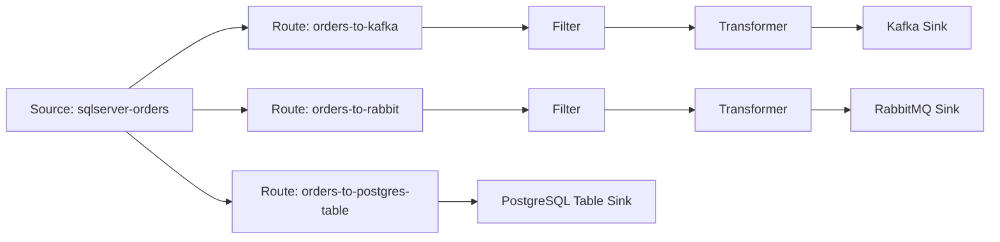

Преимущества:

- один source может иметь много sinks;
- один sink может принимать события из разных sources;
- разные routes могут иметь разные retry/backoff/batch/parallelism;
- удобно делать pause/resume;
- удобно делать redelivery по route/sink/status/error.

## 8. Асинхронная production-модель

| Задача | Рекомендуемый механизм |
|---|---|
| Потоковое чтение изменений | `IAsyncEnumerable<CdcEvent>` |
| Очереди между стадиями | `Channel<T>` |
| Backpressure | `BoundedChannel` |
| Периодические задачи | `PeriodicTimer` |
| Batch-доставка | `ISinkConnector.WriteAsync(IReadOnlyList<...>)` |
| Ограничение параллелизма | Consumer count / `MaxDegreeOfParallelism` |
| Надежность | Durable operational store |
| Ошибки | Retry scheduler + DLQ |

### Mermaid async pipeline

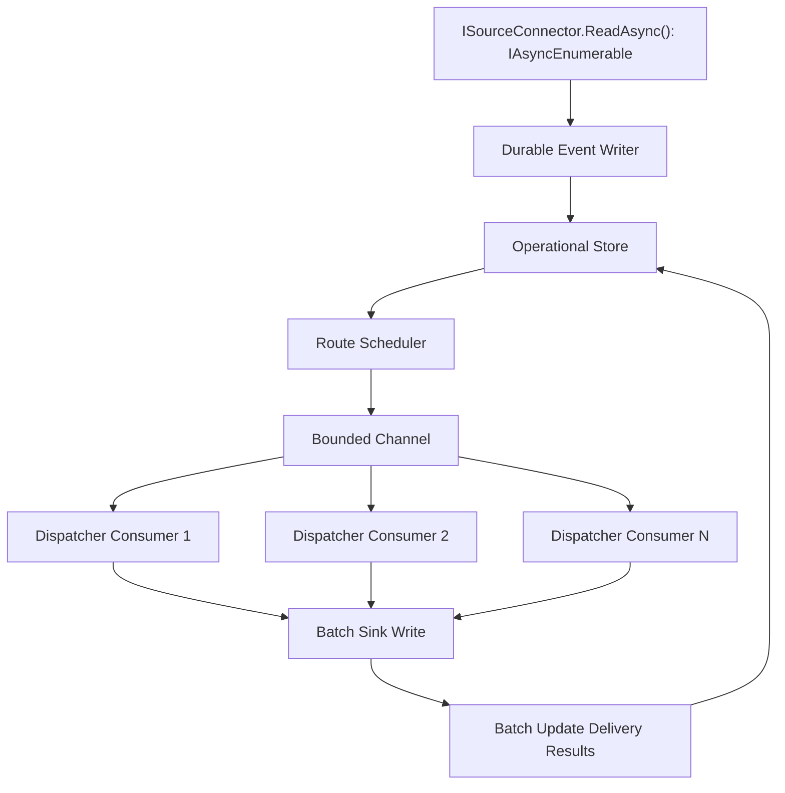

## 9. Целевые интерфейсы

```csharp
public interface ISourceConnector
{
    string Type { get; }

    IAsyncEnumerable<CdcEvent> ReadAsync(
        SourceRuntimeContext context,
        CancellationToken cancellationToken = default);
}
```

```csharp
public interface ISinkConnector
{
    string Type { get; }

    ValueTask<SinkWriteResult> WriteAsync(
        IReadOnlyList<RoutedCdcEvent> events,
        SinkRuntimeContext context,
        CancellationToken cancellationToken);
}
```

```csharp
public interface IEventFilter
{
    string Type { get; }

    ValueTask<FilterResult> IsMatchAsync(
        CdcEvent ev,
        FilterRuntimeContext context,
        CancellationToken cancellationToken);
}
```

```csharp
public interface IEventTransformer
{
    string Type { get; }

    ValueTask<JsonElement> TransformAsync(
        CdcEvent ev,
        TransformerRuntimeContext context,
        CancellationToken cancellationToken);
}
```

```csharp
public sealed record SinkWriteResult
{
    public required IReadOnlyList<SinkEventResult> Events { get; init; }
}

public sealed record SinkEventResult
{
    public required string EventId { get; init; }
    public required DeliveryStatus Status { get; init; }
    public string? ErrorCode { get; init; }
    public string? ErrorMessage { get; init; }
    public bool IsRetryable { get; init; }
}
```

## 10. Production storage architecture

### Роли хранилищ

| Хранилище | Назначение |
|---|---|
| PostgreSQL / SQL Server Operational Store | Runtime state: events, deliveries, checkpoints, locks, retry, DLQ, jobs. |
| ClickHouse Analytics Store | История, attempts, latency, failures, dashboards, агрегаты. |
| Prometheus | Time-series метрики. |
| Loki / OpenSearch | Логи. |
| Tempo / Jaeger | Distributed tracing. |

### Operational Store ER

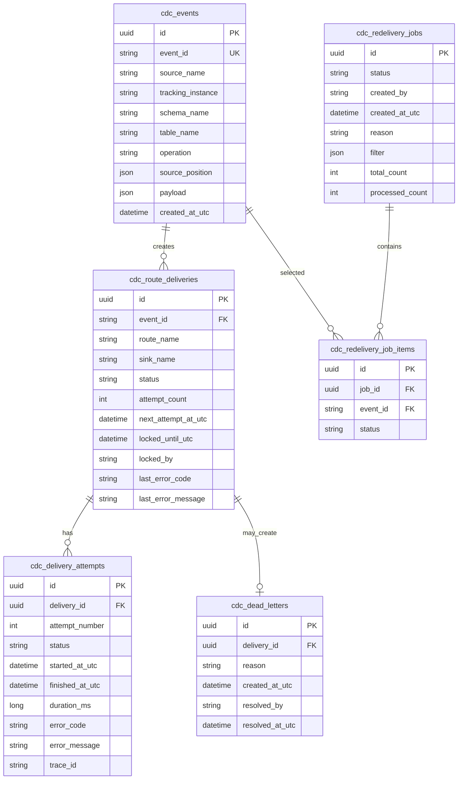

### ClickHouse Analytics Store

Рекомендуемые таблицы:

```text
cdc_event_facts
cdc_delivery_attempt_facts
cdc_route_status_snapshots
cdc_route_metrics_1m
cdc_sink_error_metrics_1m
cdc_admin_audit_facts
```

ClickHouse должен быть append-only read model для аналитики, а не основным источником runtime-истины.

## 11. Надежность доставки

### Базовая гарантия

```text
at-least-once delivery + idempotent sinks
```

### Delivery lifecycle

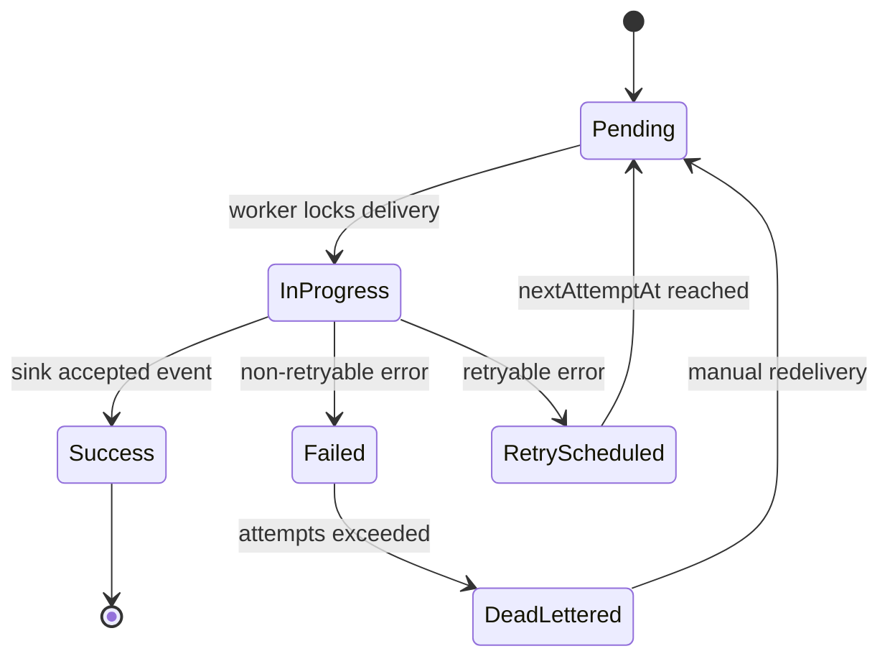

### Retry policy

```yaml
delivery:
  maxAttempts: 10
  retry:
    strategy: exponential
    initialDelayMs: 1000
    maxDelayMs: 60000
    jitter: true
```

### DLQ

DLQ должен хранить:

- event id;
- route;
- sink;
- последнюю ошибку;
- количество попыток;
- payload metadata;
- trace id;
- время попадания в DLQ;
- кто и когда переотправил или закрыл событие.

## 12. Sink connectors

### Kafka Sink

```yaml
sinks:
  - name: orders-kafka
    type: Kafka
    connection: kafka-prod
    parameters:
      topic: cdc.orders
      keyTemplate: "order:{{key.Id}}"
      acks: all
      enableIdempotence: true
      compressionType: zstd
      lingerMs: 5
```

### RabbitMQ Sink

```yaml
sinks:
  - name: orders-rabbit
    type: RabbitMq
    connection: rabbit-prod
    parameters:
      exchange: cdc.exchange
      exchangeType: topic
      routingKeyTemplate: "orders.{{operation}}"
      persistent: true
      publisherConfirms: true
```

### gRPC Sink

```yaml
sinks:
  - name: orders-grpc
    type: Grpc
    parameters:
      address: "https://orders-service:5001"
      mode: ClientStreaming
      service: "cdcbridge.v1.CdcIngestion"
      method: "PublishStream"
      timeoutMs: 30000
```

### SQL Server / PostgreSQL Table Sink

```yaml
sinks:
  - name: orders-postgres-table
    type: PostgreSqlTable
    connection: pg-analytics
    parameters:
      mode: upsert
      targetSchema: analytics
      targetTable: orders
      keyColumns: [id]
      columnMapping:
        id: "$.new.Id"
        status: "$.new.Status"
        amount: "$.new.Amount"
      deleteMode: softDelete
      softDeleteColumn: is_deleted
```

## 13. PostgreSQL Source

```yaml
sources:
  - name: postgres-payments
    type: PostgreSqlLogicalReplication
    connection: postgres-main
    parameters:
      slotName: cdc_bridge_payments
      publicationName: cdc_bridge_publication
      outputPlugin: pgoutput
      createSlotIfNotExists: true
      createPublicationIfNotExists: false
      batchSize: 1000
```

Требования:

- replication slot;
- publication;
- сохранение WAL LSN как checkpoint;
- контроль lag;
- корректный reconnect;
- учет `REPLICA IDENTITY`;
- health check slot/publication;
- защита от переполнения WAL из-за остановленного consumer.

## 14. Plugin architecture

### Цели

- установка новых sources/sinks/filters/transformers без пересборки host;
- распространение через NuGet;
- managed и native-backed плагины;
- contribution в YAML schema;
- валидация параметров;
- документация плагина в админке.

### Plugin contract

```csharp
public interface ICdcBridgePlugin
{
    PluginDescriptor Descriptor { get; }

    void ConfigureServices(
        IServiceCollection services,
        PluginHostContext context);

    IEnumerable<ComponentDescriptor> GetComponents();
}
```

### Component descriptor

```csharp
public sealed record ComponentDescriptor
{
    public required string Type { get; init; }
    public required ComponentKind Kind { get; init; }
    public required string DisplayName { get; init; }
    public required string Version { get; init; }

    public required Type RuntimeType { get; init; }
    public required Type OptionsType { get; init; }
    public Type? OptionsValidatorType { get; init; }

    public string? JsonSchemaResourceName { get; init; }
}
```

### NuGet plugin layout

```text
CdcBridge.Plugin.Kafka.1.0.0.nupkg
├── lib/net8.0/CdcBridge.Plugin.Kafka.dll
├── lib/net8.0/CdcBridge.Plugin.Kafka.deps.json
├── contentFiles/any/any/cdcbridge.plugin.json
└── schemas/kafka.schema.json
```

### Native-backed plugin layout

```text
CdcBridge.Plugin.FastTransform.1.0.0.nupkg
├── lib/net8.0/CdcBridge.Plugin.FastTransform.dll
├── runtimes/linux-x64/native/libfast_transform.so
├── runtimes/win-x64/native/fast_transform.dll
├── runtimes/osx-arm64/native/libfast_transform.dylib
└── contentFiles/any/any/cdcbridge.plugin.json
```

### Mermaid plugin loading

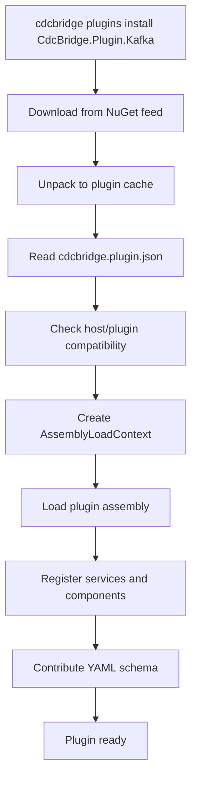

## 15. YAML Schema generation

Цель:

- автодополнение `type`;
- подсказки параметров конкретного plugin type;
- валидация required-полей;
- enum-подсказки;
- описание параметров;
- cross-reference validation между секциями.

Механизм:

```text
Core schema
  +
Plugin descriptors
  +
Options types
  +
Validators
  =
cdc-settings.schema.json
```

### Conditional schema example

```json
{
  "if": {
    "properties": {
      "type": { "const": "Kafka" }
    }
  },
  "then": {
    "properties": {
      "parameters": {
        "$ref": "#/$defs/KafkaSinkOptions"
      }
    }
  }
}
```

### Mermaid

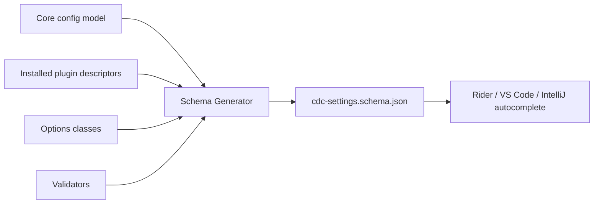

## 16. Production YAML example

```yaml
$schema: ./cdc-settings.schema.json

connections:
  - name: sqlserver-main
    type: SqlServer
    connectionString: Configuration("ConnectionStrings:SqlServerMain")

  - name: postgres-main
    type: PostgreSql
    connectionString: Configuration("ConnectionStrings:PostgresMain")

  - name: kafka-prod
    type: Kafka
    parameters:
      bootstrapServers: "kafka-1:9092,kafka-2:9092"
      securityProtocol: SASL_SSL

sources:
  - name: sqlserver-orders
    type: SqlServerCdc
    connection: sqlserver-main
    parameters:
      schema: dbo
      table: Orders
      capturedColumns:
        - Id
        - Status
        - Amount
      pollIntervalMs: 1000
      batchSize: 1000

  - name: postgres-payments
    type: PostgreSqlLogicalReplication
    connection: postgres-main
    parameters:
      slotName: cdc_bridge_payments
      publicationName: cdc_bridge_publication
      outputPlugin: pgoutput
      batchSize: 1000

filters:
  - name: only-paid-orders
    type: JsonPath
    parameters:
      expression: "$[?(@.operation == 'Update' && @.new.Status == 'Paid')]"

transformers:
  - name: order-event-v1
    type: Jsonata
    parameters:
      expression: |
        {
          "eventId": eventId,
          "orderId": new.Id,
          "status": new.Status,
          "amount": new.Amount,
          "changedAt": commitTimestamp
        }

sinks:
  - name: orders-kafka
    type: Kafka
    connection: kafka-prod
    parameters:
      topic: cdc.orders
      keyTemplate: "order:{{key.Id}}"
      acks: all
      enableIdempotence: true
      compressionType: zstd

routes:
  - name: sqlserver-orders-to-kafka
    source: sqlserver-orders
    sink: orders-kafka
    filter: only-paid-orders
    transformer: order-event-v1
    delivery:
      batchSize: 500
      parallelism: 4
      maxAttempts: 10
      retry:
        strategy: exponential
        initialDelayMs: 1000
        maxDelayMs: 60000
```

## 17. Observability architecture

### Сигналы

| Сигнал | Технология |
|---|---|
| Metrics | OpenTelemetry Metrics / Prometheus |
| Logs | Structured JSON logs / Loki / OpenSearch |
| Traces | OpenTelemetry Traces / Tempo / Jaeger |
| Domain State | Operational Store |
| Analytics | ClickHouse |

### Mermaid

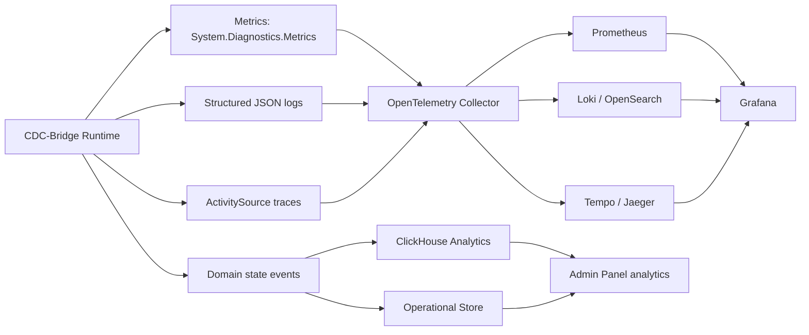

### Метрики

```text
cdcbridge_events_read_total
cdcbridge_events_buffered_total
cdcbridge_events_delivered_total
cdcbridge_events_failed_total
cdcbridge_events_deadlettered_total
cdcbridge_source_lag_seconds
cdcbridge_route_pending_count
cdcbridge_route_inflight_count
cdcbridge_route_delivery_lag_seconds
cdcbridge_route_delivery_duration_seconds
cdcbridge_sink_write_duration_seconds
cdcbridge_channel_depth
cdcbridge_storage_write_duration_seconds
```

Правило для логов:

```text
Не логировать каждое успешное событие на Information.
Information — batch summary, lifecycle events.
Warning — retryable delivery errors.
Error — DLQ, storage/source failures.
Debug — payload/details.
```

## 18. Admin Panel architecture

### Экраны

| Экран | Назначение |
|---|---|
| Overview | Состояние системы, lag, throughput, ошибки, DLQ. |
| Sources | Статус источников, checkpoint, lag, pause/resume. |
| Routes | Backlog, retry, pause/resume/drain. |
| Sinks | Latency, ошибки подключения, health. |
| Events | Поиск и просмотр событий. |
| Deliveries | Поиск и анализ доставок. |
| Dead Letter | DLQ, retry, resolve/ignore. |
| Redelivery Jobs | Управление массовой передоставкой. |
| Logs | Поиск логов через Loki/OpenSearch. |
| Traces | Переход в Tempo/Jaeger по trace id. |
| Configuration | Validate, dry-run, diff, reload. |
| Plugins | Установка, включение, отключение, обновление. |
| Alerts | Активные оповещения и история. |
| Audit | История административных действий. |

### Mermaid

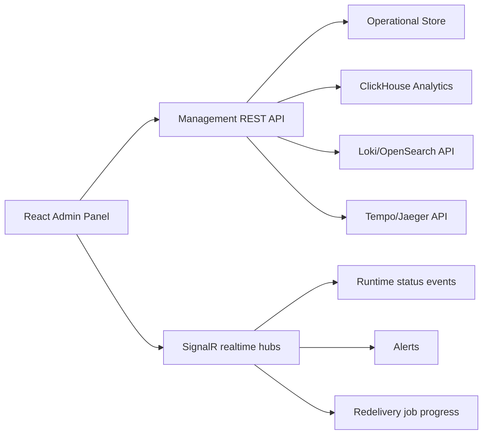

## 19. Management API

Рекомендуемые endpoints:

```text
GET  /api/v1/system/summary
GET  /api/v1/system/status

GET  /api/v1/sources
GET  /api/v1/sources/{name}
POST /api/v1/sources/{name}/pause
POST /api/v1/sources/{name}/resume

GET  /api/v1/routes
GET  /api/v1/routes/{name}
POST /api/v1/routes/{name}/pause
POST /api/v1/routes/{name}/resume
POST /api/v1/routes/{name}/drain

GET  /api/v1/sinks
GET  /api/v1/sinks/{name}

POST /api/v1/events/search
GET  /api/v1/events/{eventId}
GET  /api/v1/events/{eventId}/deliveries

POST /api/v1/deliveries/search
GET  /api/v1/deliveries/{deliveryId}

GET  /api/v1/dead-letter
POST /api/v1/dead-letter/{id}/retry
POST /api/v1/dead-letter/{id}/resolve

POST /api/v1/redelivery/jobs
GET  /api/v1/redelivery/jobs/{jobId}
POST /api/v1/redelivery/jobs/{jobId}/cancel

GET  /api/v1/configuration/current
POST /api/v1/configuration/validate
POST /api/v1/configuration/dry-run
POST /api/v1/configuration/reload

GET  /api/v1/plugins
POST /api/v1/plugins/install
POST /api/v1/plugins/{id}/enable
POST /api/v1/plugins/{id}/disable
```

## 20. Redelivery architecture

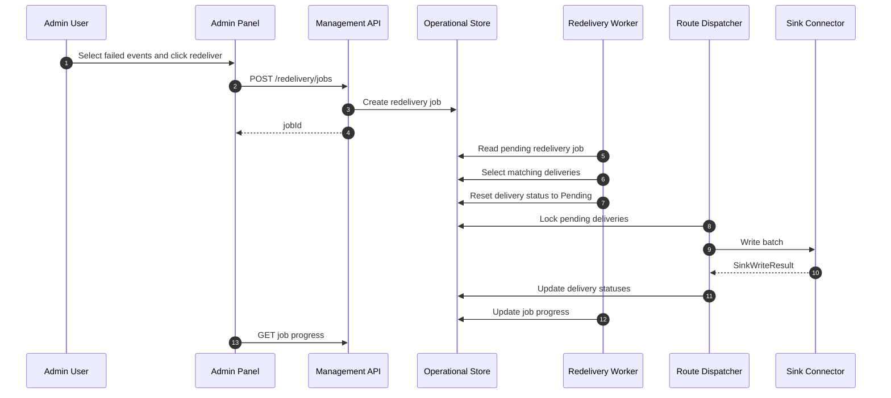

Передоставка должна работать через jobs, а не внутри HTTP-запроса пользователя.

## 21. Deployment architecture

### Single-node production

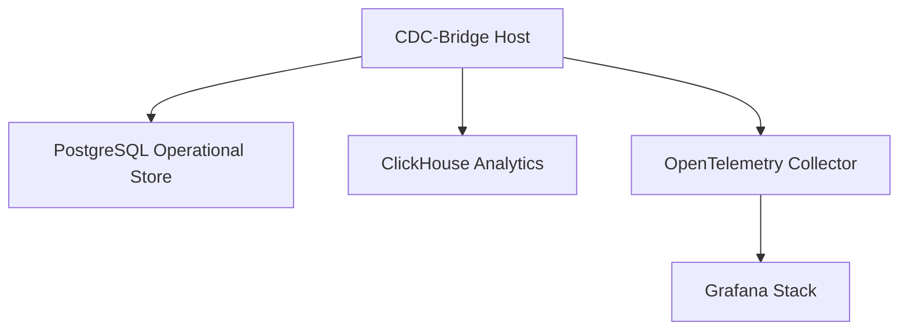

### Multi-instance production

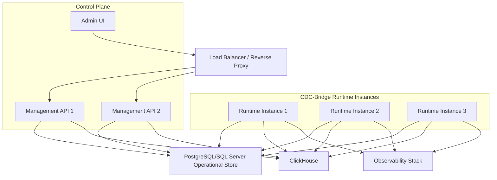

Для multi-instance режима нужны:

- distributed locks;
- delivery task locking;
- source ownership;
- heartbeat;
- leader election или partition assignment;
- graceful shutdown;
- idempotent event ids;
- idempotent sink behavior.

## 22. Security architecture

Минимальные требования:

- OIDC/JWT для админки;
- API keys для automation;
- RBAC;
- audit log;
- mTLS или private network для service-to-service;
- secret providers;
- plugin allowlist;
- package signature/hash verification;
- отдельные роли для просмотра и управления.

| Роль | Возможности |
|---|---|
| Viewer | Просмотр dashboard, events, deliveries. |
| Operator | Pause/resume routes, retry events, manage DLQ. |
| Admin | Управление конфигурацией, plugins, users. |
| SecurityAdmin | Управление ключами, секретами, audit. |

## 23. Production roadmap

### Этап 1. Stabilization

- Зафиксировать стабильные версии зависимостей.
- Синхронизировать Dockerfile со структурой solution.
- Добавить README и quick start.
- Добавить CI: build, test, docker build.
- Перевести успешные per-event логи на Debug.
- Добавить индексы.
- Добавить batch update delivery statuses.

### Этап 2. Runtime refactoring

- Ввести `CdcEvent`.
- Ввести `SourcePosition`.
- Ввести `routes`.
- Ввести batch-based `ISinkConnector`.
- Ввести `IAsyncEnumerable` для sources.
- Ввести bounded `Channel<T>` для delivery tasks.
- Добавить DLQ.

### Этап 3. Production persistence

- Добавить PostgreSQL или SQL Server operational store.
- Реализовать delivery locks.
- Реализовать retry scheduler.
- Реализовать redelivery jobs.
- Реализовать idempotency table для database sinks.

### Этап 4. New connectors

- Kafka sink.
- RabbitMQ sink.
- PostgreSQL logical replication source.
- gRPC sink.
- SQL Server table sink.
- PostgreSQL table sink.
- ClickHouse analytics exporter.

### Этап 5. Observability

- OpenTelemetry metrics.
- ActivitySource traces.
- JSON structured logs.
- OpenTelemetry Collector.
- Grafana dashboards.
- Alert rules.

### Этап 6. Admin Panel

- Overview dashboard.
- Sources/routes/sinks pages.
- Event explorer.
- Delivery explorer.
- DLQ page.
- Redelivery jobs.
- Config validation/reload.
- Plugin management.

### Этап 7. Plugin platform

- Plugin SDK.
- NuGet plugin installer.
- AssemblyLoadContext isolation.
- Plugin manifest.
- Generated YAML schema.
- Native-backed plugins.
- Out-of-process plugin mode.

## 24. Итоговая целевая архитектура

Целевой CDC-Bridge:

```text
Plugin-based, route-driven, observable, self-hosted CDC/Event Delivery Platform for .NET teams.
```

Главные свойства:

- расширяемые источники;
- расширяемые приемники;
- YAML-конфигурация с автоподсказками;
- надежная at-least-once доставка;
- idempotency;
- DLQ;
- redelivery;
- production state store;
- ClickHouse analytics;
- OpenTelemetry observability;
- удобная админка;
- NuGet-based plugin ecosystem;
- поддержка native-backed плагинов через Rust/C++.
