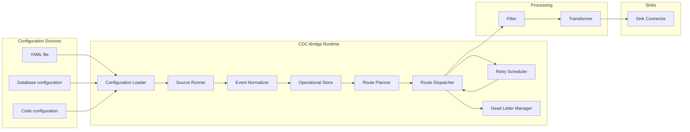
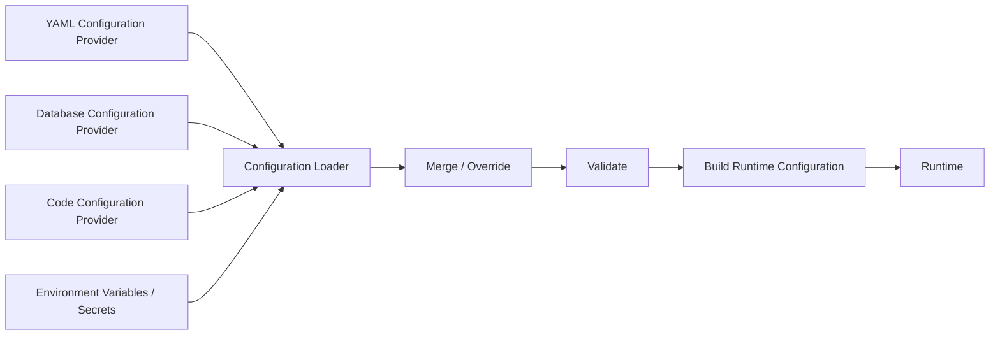
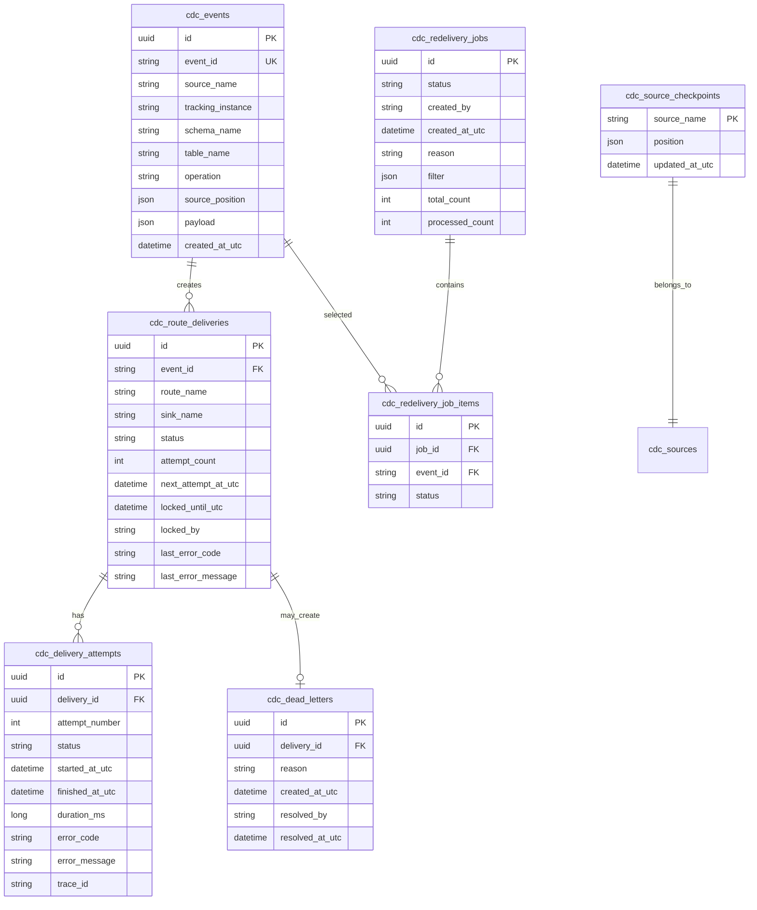

# Техническое задание №1  
# Доработка ядра CDC-Bridge и базовых компонентов для выпуска в Production

## 1. Общие сведения

### 1.1. Наименование работ

Доработка ядра системы **CDC-Bridge** и базовых компонентов для подготовки сервиса к production-эксплуатации.

### 1.2. Назначение системы

CDC-Bridge — self-hosted сервис для чтения изменений из источников данных, нормализации событий, маршрутизации, фильтрации, трансформации и надежной доставки событий в различные приемники.

Система должна поддерживать:

- надежную доставку событий;
- расширяемую архитектуру источников и приемников;
- конфигурацию из YAML, базы данных и кода;
- управление через API и админскую панель;
- наблюдаемость;
- retry/redelivery;
- DLQ;
- unit и integration тестирование;
- запуск интеграционных окружений через Docker Compose.

### 1.3. Цели доработки

Основные цели:

1. Подготовить ядро системы к production-нагрузке.
2. Перейти от модели `TrackingInstance -> Receiver` к гибкой route-driven архитектуре.
3. Ввести универсальную модель события `CdcEvent`.
4. Реализовать надежную модель хранения событий, доставок, checkpoint-ов и DLQ.
5. Улучшить производительность обработки сотен и тысяч событий.
6. Обеспечить гибкую загрузку конфигурации:
   - из YAML-файла;
   - из базы данных;
   - из кода;
   - из комбинированных источников.
7. Заложить основу для плагинов и новых коннекторов.
8. Реализовать полноценную наблюдаемость.
9. Ввести качественное unit и integration тестирование.

---

## 2. Текущее состояние и основные ограничения

### 2.1. Текущая модель

Текущая модель системы:

```text
SQL Server CDC
    ↓
SourceWorker
    ↓
SQLite Buffer
    ↓
ReceiverWorker
    ↓
Filter → Transformer → WebhookReceiver
```

### 2.2. Основные ограничения

| Ограничение | Последствие |
|---|---|
| `ICdcSource.GetChanges()` возвращает `Task<IEnumerable<TrackedChange>>` | Пачка изменений полностью материализуется в памяти. |
| ReceiverWorker обрабатывает события последовательно | Низкий throughput при медленных получателях. |
| Статус доставки обновляется по одному событию | Много мелких транзакций в SQLite. |
| SQLite используется как основное runtime-хранилище | Ограниченная параллельная запись и масштабирование. |
| Нет route-модели | Сложно гибко маршрутизировать одно событие в несколько приемников. |
| Нет полноценного DLQ | Сложно управлять окончательно не доставленными событиями. |
| Нет redelivery jobs | Массовая повторная доставка событий не формализована. |
| Нет единого `CdcEvent` | Сложнее добавить PostgreSQL, MySQL, Kafka и другие источники. |
| Конфигурация фактически file-first | Нельзя удобно управлять конфигурацией из админки. |
| Нет plugin metadata/schema | Нельзя генерировать полную JSON Schema для YAML. |
| Наблюдаемость недостаточно отделена от runtime | Логи/метрики/аналитика могут нагружать основной сервис. |

---

## 3. Целевая архитектура ядра

### 3.1. Общая схема



### 3.2. Ключевые архитектурные принципы

1. **Route-driven delivery**  
   Маршрутизация должна строиться через сущность `Route`, а не через прямую связь receiver с tracking instance.

2. **Canonical event model**  
   Все события из любых источников приводятся к единой модели `CdcEvent`.

3. **Batch-first processing**  
   Система должна поддерживать batch-чтение, batch-доставку и batch-обновление статусов.

4. **At-least-once delivery**  
   Базовая гарантия доставки — минимум один раз.

5. **Idempotency by design**  
   Система должна формировать детерминированный `EventId`, чтобы приемники могли безопасно обрабатывать дубли.

6. **Backpressure**  
   Внутренние очереди должны быть ограниченными (`BoundedChannel`) и не должны приводить к бесконтрольному росту памяти.

7. **Operational state отдельно от analytics**  
   Runtime-хранилище должно отвечать за точное состояние доставки, а аналитика должна выноситься в отдельный контур.

8. **Configuration as data**  
   Конфигурация должна быть доступна из файла, базы и кода, иметь версионирование, валидацию и dry-run.

9. **Observability-first**  
   Метрики, логи и трассировка должны быть встроены в архитектуру с самого начала.

---

## 4. Новая доменная модель

### 4.1. CdcEvent

Необходимо ввести единую модель события:

```csharp
public sealed record CdcEvent
{
    public required string EventId { get; init; }
    public required string SourceName { get; init; }
    public required string TrackingInstanceName { get; init; }

    public required string Database { get; init; }
    public required string Schema { get; init; }
    public required string Table { get; init; }

    public required ChangeOperation Operation { get; init; }
    public required SourcePosition Position { get; init; }

    public string? TransactionId { get; init; }
    public long? TransactionSequence { get; init; }

    public DateTimeOffset? CommitTimestamp { get; init; }

    public IReadOnlyDictionary<string, object?> Key { get; init; }
        = new Dictionary<string, object?>();

    public JsonElement? Old { get; init; }
    public JsonElement? New { get; init; }

    public Dictionary<string, string> Metadata { get; init; } = new();
}
```

### 4.2. SourcePosition

```csharp
public sealed record SourcePosition
{
    public required string Kind { get; init; }
    public required string Value { get; init; }
    public Dictionary<string, string> Parts { get; init; } = new();
}
```

Примеры:

```json
{
  "kind": "sqlserver-lsn",
  "value": "0000002A:000001B0:0003"
}
```

```json
{
  "kind": "postgres-wal-lsn",
  "value": "16/B374D848"
}
```

```json
{
  "kind": "mysql-binlog-position",
  "value": "mysql-bin.000123:456789"
}
```

### 4.3. Route

```csharp
public sealed record RouteDefinition
{
    public required string Name { get; init; }
    public required string Source { get; init; }
    public required string Sink { get; init; }

    public string? Filter { get; init; }
    public string? Transformer { get; init; }

    public bool Active { get; init; } = true;

    public required DeliveryPolicy Delivery { get; init; }
}
```

### 4.4. DeliveryPolicy

```csharp
public sealed record DeliveryPolicy
{
    public int BatchSize { get; init; } = 500;
    public int Parallelism { get; init; } = 4;
    public int MaxAttempts { get; init; } = 10;
    public bool PreserveOrderingByKey { get; init; }
    public string? OrderingKeyExpression { get; init; }

    public RetryPolicy Retry { get; init; } = RetryPolicy.Default;
}
```

### 4.5. DeliveryStatus

```csharp
public enum DeliveryStatus
{
    Pending,
    InProgress,
    Success,
    RetryScheduled,
    Failed,
    DeadLettered,
    Ignored
}
```

---

## 5. Целевые интерфейсы ядра

### 5.1. Source connector

```csharp
public interface ISourceConnector
{
    string Type { get; }

    IAsyncEnumerable<CdcEvent> ReadAsync(
        SourceRuntimeContext context,
        CancellationToken cancellationToken = default);
}
```

### 5.2. Sink connector

```csharp
public interface ISinkConnector
{
    string Type { get; }

    ValueTask<SinkWriteResult> WriteAsync(
        IReadOnlyList<RoutedCdcEvent> events,
        SinkRuntimeContext context,
        CancellationToken cancellationToken);
}
```

### 5.3. Filter

```csharp
public interface IEventFilter
{
    string Type { get; }

    ValueTask<FilterResult> IsMatchAsync(
        CdcEvent ev,
        FilterRuntimeContext context,
        CancellationToken cancellationToken);
}
```

### 5.4. Transformer

```csharp
public interface IEventTransformer
{
    string Type { get; }

    ValueTask<JsonElement> TransformAsync(
        CdcEvent ev,
        TransformerRuntimeContext context,
        CancellationToken cancellationToken);
}
```

### 5.5. Event store

```csharp
public interface ICdcEventStore
{
    ValueTask AppendBatchAsync(
        IReadOnlyList<CdcEvent> events,
        SourcePosition newCheckpoint,
        CancellationToken cancellationToken);

    IAsyncEnumerable<DeliveryTask> ReadPendingDeliveriesAsync(
        string routeName,
        int batchSize,
        CancellationToken cancellationToken);

    ValueTask UpdateDeliveryResultsAsync(
        IReadOnlyList<DeliveryResult> results,
        CancellationToken cancellationToken);
}
```

---

## 6. Конфигурация системы

### 6.1. Требование

Система должна поддерживать загрузку конфигурации из нескольких источников:

1. YAML-файл.
2. База данных.
3. Код приложения.
4. Композитная конфигурация из нескольких источников.

### 6.2. Общая модель



### 6.3. Интерфейс поставщика конфигурации

```csharp
public interface ICdcConfigurationProvider
{
    string Name { get; }

    ValueTask<CdcConfigurationDocument?> LoadAsync(
        CancellationToken cancellationToken);

    IAsyncEnumerable<ConfigurationChange> WatchAsync(
        CancellationToken cancellationToken);
}
```

### 6.4. YAML provider

Должен уметь:

- читать один YAML-файл;
- читать несколько YAML-файлов из директории;
- поддерживать `$schema`;
- поддерживать подстановки:
  - `Configuration("...")`;
  - `Secret("...")`;
  - `File("...")`;
- поддерживать hot reload, если включено.

### 6.5. Database provider

Должен уметь:

- читать активную версию конфигурации из базы;
- хранить версии конфигурации;
- хранить drafts;
- выполнять validate/dry-run;
- активировать новую версию;
- откатывать конфигурацию на предыдущую версию;
- хранить автора изменения;
- хранить комментарий к изменению.

Минимальная структура таблиц:

```text
cdc_configurations
cdc_configuration_versions
cdc_configuration_audit
```

### 6.6. Code provider

Должен позволять описывать конфигурацию из кода:

```csharp
services.AddCdcBridge(builder =>
{
    builder.AddConnection("sql-main", c =>
    {
        c.Type = "SqlServer";
        c.ConnectionString = configuration.GetConnectionString("SqlMain");
    });

    builder.AddSource("orders-source", s =>
    {
        s.Type = "SqlServerCdc";
        s.Connection = "sql-main";
        s.Parameters["schema"] = "dbo";
        s.Parameters["table"] = "Orders";
    });

    builder.AddSink("orders-kafka", s =>
    {
        s.Type = "Kafka";
        s.Connection = "kafka-prod";
        s.Parameters["topic"] = "cdc.orders";
    });

    builder.AddRoute("orders-to-kafka", r =>
    {
        r.Source = "orders-source";
        r.Sink = "orders-kafka";
        r.Delivery.BatchSize = 500;
    });
});
```

### 6.7. Приоритеты и merge

Необходимо реализовать стратегию объединения конфигураций.

Пример приоритетов по умолчанию:

```text
Code defaults
    ↓ overridden by
YAML
    ↓ overridden by
Database active configuration
    ↓ overridden by
Environment-specific overrides
```

Требуется поддержать режимы:

| Режим | Описание |
|---|---|
| `Replace` | Конфигурация из источника полностью заменяет предыдущую. |
| `MergeByName` | Секции объединяются по `name`. |
| `OverrideByName` | Элементы с одинаковым `name` переопределяются. |
| `AppendOnly` | Разрешено только добавление новых элементов. |

### 6.8. Валидация конфигурации

Должны выполняться проверки:

- обязательные секции;
- обязательные поля;
- уникальность имен;
- cross-reference проверки;
- существование connection/source/sink/filter/transformer;
- корректность типов компонентов;
- корректность параметров конкретного плагина;
- проверка конфликтов route;
- проверка совместимости плагинов;
- dry-run подключения к внешним системам;
- dry-run route planning.

### 6.9. JSON Schema

Необходимо реализовать генерацию `cdc-settings.schema.json`.

Схема должна учитывать:

- базовую модель конфигурации;
- установленные плагины;
- `OptionsType` компонентов;
- XML documentation или attributes;
- FluentValidation или собственные validators;
- enum-значения;
- required-поля;
- примеры.

---

## 7. Производительность и оптимизация

### 7.1. Batch processing

Необходимо реализовать:

- batch insert событий в operational store;
- batch creation delivery tasks;
- batch read pending deliveries;
- batch delivery в sinks;
- batch update delivery statuses.

### 7.2. Bounded channels

Для внутреннего pipeline использовать `Channel<T>`.

Требования:

- `BoundedChannel` по route или sink;
- настройка capacity;
- `FullMode = Wait`;
- метрика глубины очереди;
- graceful shutdown;
- запрет потери бизнес-событий.

### 7.3. Parallelism

Необходимо реализовать:

- настройку `parallelism` на route;
- ограничение одновременных delivery batch;
- раздельный parallelism для разных sinks;
- сохранение порядка по ключу при необходимости;
- partitioned channels для ordering by key.

### 7.4. Storage optimization

Для operational store реализовать:

- индексы под pending deliveries;
- индексы под event search;
- индексы под route/status/time;
- idempotency constraint по `event_id`;
- delivery uniqueness по `event_id + route_name + sink_name`;
- lock model для нескольких runtime-инстансов;
- cleanup/retention policies.

### 7.5. SQL Server CDC optimization

Необходимо:

- читать изменения пачками;
- ограничивать max batch size;
- не вызывать дорогие операции для каждой строки без необходимости;
- кэшировать metadata;
- корректно обрабатывать LSN range;
- сохранять checkpoint атомарно вместе с событиями.

### 7.6. Logging optimization

Необходимо:

- не писать успешную доставку каждого события на `Information`;
- логировать успешные batch summary;
- ошибки delivery логировать структурированно;
- payload писать только на `Debug` и с ограничением размера;
- не использовать SQLite как production log store.

---

## 8. Operational Store

### 8.1. Требование

Operational Store должен быть заменяемым.

Поддерживаемые реализации:

1. SQLite — dev/demo/single-node.
2. PostgreSQL — production default.
3. SQL Server — production alternative.

### 8.2. Основные таблицы



---

## 9. Retry, DLQ и Redelivery

### 9.1. Retry

Требования:

- поддержка fixed retry;
- поддержка exponential backoff;
- поддержка jitter;
- настройка max attempts;
- classification retryable/non-retryable;
- сохранение attempt history.

### 9.2. DLQ

Событие должно попадать в DLQ, если:

- превышен лимит попыток;
- ошибка помечена как non-retryable;
- route отключен политикой;
- событие невозможно обработать из-за ошибки конфигурации.

### 9.3. Redelivery

Передоставка должна работать через jobs.

Функциональность:

- retry одного event;
- retry одного delivery;
- retry всех событий по фильтру;
- retry из DLQ;
- retry в другой sink;
- dry-run количества затрагиваемых событий;
- отмена redelivery job;
- audit log действия.

---

## 10. Observability

### 10.1. Метрики

Реализовать метрики:

```text
cdcbridge_events_read_total
cdcbridge_events_buffered_total
cdcbridge_events_delivered_total
cdcbridge_events_failed_total
cdcbridge_events_deadlettered_total

cdcbridge_source_lag_seconds
cdcbridge_route_pending_count
cdcbridge_route_inflight_count
cdcbridge_route_delivery_lag_seconds
cdcbridge_route_delivery_duration_seconds
cdcbridge_sink_write_duration_seconds
cdcbridge_channel_depth
cdcbridge_storage_write_duration_seconds
```

### 10.2. Логи

Требования:

- структурированные JSON-логи;
- correlation id;
- trace id;
- event id;
- route;
- source;
- sink;
- error code;
- attempt number.

### 10.3. Traces

Добавить `ActivitySource` со span-ами:

```text
cdc.source.read
cdc.event.persist
cdc.route.plan
cdc.filter.apply
cdc.transform.apply
cdc.sink.write
cdc.delivery.update_status
```

### 10.4. Экспорт

Поддержать:

- OpenTelemetry Collector;
- Prometheus;
- Loki/OpenSearch;
- Tempo/Jaeger;
- Grafana dashboards.

---

## 11. Management API

### 11.1. Обязательные endpoints

```text
GET  /api/v1/system/summary
GET  /api/v1/system/status

GET  /api/v1/sources
GET  /api/v1/sources/{name}
POST /api/v1/sources/{name}/pause
POST /api/v1/sources/{name}/resume

GET  /api/v1/routes
GET  /api/v1/routes/{name}
POST /api/v1/routes/{name}/pause
POST /api/v1/routes/{name}/resume
POST /api/v1/routes/{name}/drain

GET  /api/v1/sinks
GET  /api/v1/sinks/{name}

POST /api/v1/events/search
GET  /api/v1/events/{eventId}
GET  /api/v1/events/{eventId}/deliveries

POST /api/v1/deliveries/search
GET  /api/v1/deliveries/{deliveryId}

GET  /api/v1/dead-letter
POST /api/v1/dead-letter/{id}/retry
POST /api/v1/dead-letter/{id}/resolve

POST /api/v1/redelivery/jobs
GET  /api/v1/redelivery/jobs/{jobId}
POST /api/v1/redelivery/jobs/{jobId}/cancel

GET  /api/v1/configuration/current
POST /api/v1/configuration/validate
POST /api/v1/configuration/dry-run
POST /api/v1/configuration/reload
```

---

## 12. Plugin platform foundation

В рамках доработки ядра требуется заложить основу plugin platform.

### 12.1. Требования

- `CdcBridge.Plugin.Abstractions`;
- `CdcBridge.Plugin.Sdk`;
- plugin descriptor;
- component descriptor;
- загрузка trusted in-process plugins;
- подготовка к NuGet plugin installation;
- поддержка schema contribution;
- проверка совместимости plugin/host.

### 12.2. Plugin descriptor

```csharp
public interface ICdcBridgePlugin
{
    PluginDescriptor Descriptor { get; }

    void ConfigureServices(
        IServiceCollection services,
        PluginHostContext context);

    IEnumerable<ComponentDescriptor> GetComponents();
}
```

### 12.3. Безопасность

Важно: in-process plugins считаются доверенными.

Для недоверенных плагинов в будущих версиях должен использоваться out-of-process режим через gRPC/container isolation.

---

## 13. Тестирование

### 13.1. Unit tests

Покрыть unit-тестами:

#### Configuration

- чтение YAML;
- чтение DB конфигурации;
- code-based configuration builder;
- merge стратегий;
- validation;
- cross-reference validation;
- schema generation;
- Secret/File/Configuration preprocessors.

#### Runtime

- SourceRunner;
- RoutePlanner;
- RouteDispatcher;
- RetryScheduler;
- DeadLetterManager;
- RedeliveryJobProcessor;
- graceful shutdown;
- backpressure behavior;
- ordering by key;
- batch processing.

#### Persistence

- append batch;
- checkpoint update;
- read pending deliveries;
- lock delivery tasks;
- update delivery results;
- retry scheduling;
- DLQ creation;
- cleanup;
- idempotency.

#### Components

- JsonPath filter;
- StateTransition filter;
- JSONata transformer;
- Webhook sink adapter.

### 13.2. Integration tests

Интеграционные тесты должны запускать зависимости через Docker Compose.

Требуется подготовить compose-файлы:

```text
docker-compose.integration.yml
docker-compose.sqlserver.yml
docker-compose.postgres.yml
docker-compose.observability.yml
```

Минимальный набор сервисов:

- SQL Server;
- PostgreSQL;
- RabbitMQ;
- Kafka/Redpanda;
- ClickHouse;
- тестовый Webhook Receiver;
- тестовый gRPC Receiver;
- CDC-Bridge Host.

### 13.3. Интеграционные сценарии

| Сценарий | Описание |
|---|---|
| SQL Server CDC read | Вставить/обновить/удалить строки, проверить появление `CdcEvent`. |
| Buffer durability | Перезапустить сервис, проверить отсутствие потери pending events. |
| Delivery success | Доставить событие в тестовый webhook. |
| Delivery retry | Получатель временно возвращает 500, затем 200. |
| DLQ | Получатель всегда возвращает ошибку, событие уходит в DLQ. |
| Redelivery | Переотправить событие из DLQ. |
| Configuration reload | Загрузить новую конфигурацию из YAML/DB. |
| Route pause/resume | Приостановить и возобновить route. |
| Backpressure | Замедлить receiver, проверить ограничение очереди. |
| Observability | Проверить наличие метрик и trace id. |

### 13.4. Testcontainers

Допускается использовать Testcontainers for .NET для части интеграционных тестов, но основным способом полного стенда должен быть Docker Compose.

---

## 14. CI/CD требования

Pipeline должен включать:

```text
dotnet restore
dotnet format --verify-no-changes
dotnet build --configuration Release
dotnet test --configuration Release
integration tests
docker build
schema generation check
OpenAPI generation check
```

Отдельные job-и:

- unit tests;
- integration tests;
- docker image build;
- security/dependency scan;
- documentation validation;
- plugin compatibility tests.

---

## 15. Критерии приемки

### 15.1. Архитектура

- Введена route-driven модель.
- Введена модель `CdcEvent`.
- Старые receiver/trackingInstance сценарии либо мигрированы, либо поддерживаются через compatibility layer.
- Конфигурация доступна из YAML, БД и кода.
- Есть schema generation.

### 15.2. Производительность

- Поддержана batch-доставка.
- Поддержан batch update статусов.
- Receiver/Sink pipeline поддерживает ограниченный parallelism.
- Есть bounded channels и backpressure.
- Нет per-event Information логов при успешной доставке.

### 15.3. Надежность

- Checkpoint и события сохраняются атомарно.
- Реализованы retry и DLQ.
- Реализованы redelivery jobs.
- Есть idempotency по `event_id`.
- Сервис корректно восстанавливается после рестарта.

### 15.4. Наблюдаемость

- Есть metrics endpoint или OTLP export.
- Есть structured logs.
- Есть tracing.
- Есть базовые Grafana dashboard templates.

### 15.5. Тесты

- Unit-тесты покрывают ключевую бизнес-логику.
- Integration-тесты запускаются через Docker Compose.
- В CI есть отдельный job для интеграционных тестов.

---

## 16. Рекомендуемая очередность работ

### Этап 1. Рефакторинг моделей и конфигурации

1. Ввести `CdcEvent`.
2. Ввести `SourcePosition`.
3. Ввести `sources`, `sinks`, `routes`.
4. Реализовать compatibility layer для старых `trackingInstances/receivers`.
5. Реализовать YAML/DB/Code configuration providers.
6. Реализовать validation и dry-run.

### Этап 2. Runtime pipeline

1. Перевести sources на `IAsyncEnumerable`.
2. Ввести bounded channels.
3. Реализовать RouteScheduler.
4. Реализовать RouteDispatcher.
5. Реализовать batch sink contract.
6. Реализовать batch status update.

### Этап 3. Operational Store

1. Реализовать PostgreSQL store.
2. Реализовать SQL Server store.
3. Оставить SQLite как dev provider.
4. Реализовать locks.
5. Реализовать retry/DLQ/redelivery.

### Этап 4. Observability и API

1. Добавить метрики.
2. Добавить structured logs.
3. Добавить traces.
4. Реализовать Management API.
5. Реализовать базовые admin endpoints.

### Этап 5. Тесты и CI

1. Unit tests.
2. Integration tests.
3. Docker Compose стенды.
4. CI pipeline.
5. Performance smoke tests.
