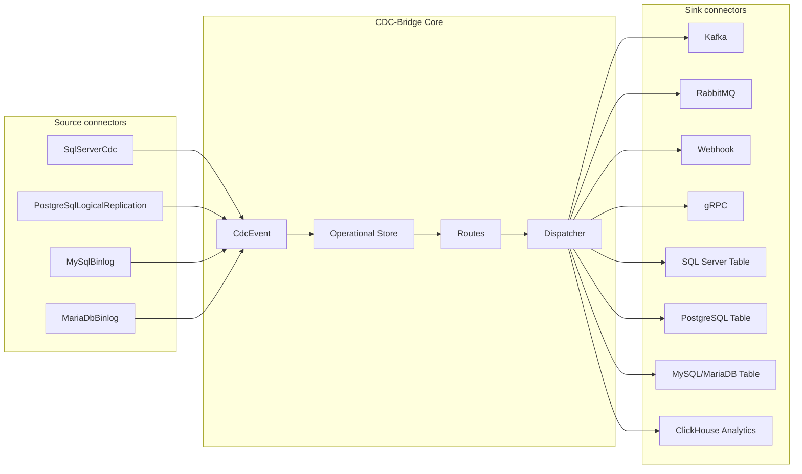

# Техническое задание №2  
# Разработка новых коннекторов источников и приемников для CDC-Bridge

## 1. Общие сведения

### 1.1. Наименование работ

Разработка новых source и sink коннекторов для CDC-Bridge после завершения доработки ядра системы.

### 1.2. Предварительное условие

Данное ТЗ должно выполняться после завершения работ по ТЗ №1:

- введена модель `CdcEvent`;
- введена route-driven архитектура;
- реализован batch-based `ISinkConnector`;
- реализован `ISourceConnector` на базе `IAsyncEnumerable`;
- реализованы retry/DLQ/redelivery;
- реализован operational store;
- реализованы configuration providers;
- реализован plugin SDK;
- реализована генерация YAML schema;
- подготовлена инфраструктура unit и integration тестирования.

### 1.3. Цель

Расширить CDC-Bridge набором production-ready коннекторов источников и приемников.

Источники:

- SQL Server CDC;
- PostgreSQL Logical Replication;
- MySQL Binlog;
- MariaDB Binlog.

Приемники:

- Apache Kafka;
- RabbitMQ;
- Webhook;
- gRPC;
- SQL Server Table Sink;
- PostgreSQL Table Sink;
- MySQL/MariaDB Table Sink;
- ClickHouse Analytics Sink.

---

## 2. Общие требования ко всем коннекторам

### 2.1. Packaging

Каждый коннектор должен быть отдельным проектом и потенциально отдельным NuGet-пакетом.

```text
CdcBridge.Connectors.SqlServer
CdcBridge.Connectors.PostgreSql
CdcBridge.Connectors.MySql
CdcBridge.Connectors.MariaDb
CdcBridge.Connectors.Kafka
CdcBridge.Connectors.RabbitMq
CdcBridge.Connectors.Grpc
CdcBridge.Connectors.Webhook
CdcBridge.Connectors.DatabaseSinks
CdcBridge.Connectors.ClickHouse
```

### 2.2. Plugin metadata

Каждый коннектор должен предоставлять:

- plugin descriptor;
- component descriptor;
- options type;
- validator;
- JSON Schema fragment;
- пример YAML;
- документацию параметров;
- health check;
- тесты.

### 2.3. Configuration schema

Для каждого коннектора должна генерироваться JSON Schema с:

- required-полями;
- enum-подсказками;
- описанием параметров;
- default values;
- examples;
- conditional validation по `type`.

### 2.4. Observability

Каждый коннектор должен отдавать:

- метрики успешных операций;
- метрики ошибок;
- latency;
- batch size;
- retryable/non-retryable errors;
- health status;
- structured logs;
- traces.

### 2.5. Error model

Все коннекторы должны возвращать унифицированные ошибки:

```csharp
public sealed record ConnectorError
{
    public required string Code { get; init; }
    public required string Message { get; init; }
    public bool IsRetryable { get; init; }
    public string? Details { get; init; }
}
```

### 2.6. Idempotency

Все sink-коннекторы должны иметь стратегию идемпотентности:

- deterministic key;
- external idempotency key;
- upsert;
- applied events table;
- idempotent producer;
- deduplication table;
- или явно задокументированное отсутствие idempotency.

---

## 3. Source connectors

## 3.1. SQL Server CDC Source

### Назначение

Чтение изменений из SQL Server CDC.

### Тип

```yaml
type: SqlServerCdc
```

### Пример конфигурации

```yaml
sources:
  - name: sqlserver-orders
    type: SqlServerCdc
    connection: sqlserver-main
    parameters:
      schema: dbo
      table: Orders
      capturedColumns:
        - Id
        - Status
        - Amount
      pollIntervalMs: 1000
      batchSize: 1000
      autoEnableCdc: false
```

### Функциональные требования

- чтение `insert`, `update`, `delete`;
- поддержка captured columns;
- поддержка LSN checkpoint;
- batch reading;
- auto-enable CDC в dev/admin mode;
- проверка наличия CDC на базе и таблице;
- корректная обработка retention window;
- метрика source lag;
- dry-run диагностика прав и CDC-состояния.

### Acceptance criteria

- insert/update/delete превращаются в корректный `CdcEvent`;
- checkpoint сохраняется и используется после рестарта;
- события не теряются при рестарте;
- batch size ограничивает объем чтения;
- integration test поднимает SQL Server через Docker Compose.

---

## 3.2. PostgreSQL Logical Replication Source

### Назначение

Чтение изменений из PostgreSQL через logical replication slot/publication.

### Тип

```yaml
type: PostgreSqlLogicalReplication
```

### Пример конфигурации

```yaml
sources:
  - name: postgres-orders
    type: PostgreSqlLogicalReplication
    connection: postgres-main
    parameters:
      slotName: cdc_bridge_orders
      publicationName: cdc_bridge_publication
      outputPlugin: pgoutput
      createSlotIfNotExists: true
      createPublicationIfNotExists: false
      batchSize: 1000
```

### Функциональные требования

- чтение insert/update/delete;
- работа с replication slot;
- сохранение WAL LSN checkpoint;
- reconnect после разрыва соединения;
- контроль lag;
- предупреждение о проблемах с WAL retention;
- диагностика `REPLICA IDENTITY`;
- поддержка publication;
- настройка automatic slot/publication creation.

### Acceptance criteria

- изменения в PostgreSQL превращаются в `CdcEvent`;
- WAL LSN сохраняется как `SourcePosition`;
- после рестарта чтение продолжается с последней позиции;
- если source остановлен, система показывает lag;
- integration test поднимает PostgreSQL через Docker Compose.

---

## 3.3. MySQL Binlog Source

### Назначение

Чтение изменений из MySQL binary log.

### Тип

```yaml
type: MySqlBinlog
```

### Пример конфигурации

```yaml
sources:
  - name: mysql-orders
    type: MySqlBinlog
    connection: mysql-main
    parameters:
      serverId: 5401
      database: app_db
      tables:
        - orders
        - payments
      includeSchemaChanges: false
      batchSize: 1000
      heartbeatIntervalMs: 5000
```

### Функциональные требования

- подключение к MySQL replication/binlog;
- чтение row-based events;
- поддержка insert/update/delete;
- сохранение позиции `binlog file + position`;
- поддержка GTID, если включен;
- фильтрация по database/table;
- reconnect;
- heartbeat;
- диагностика binlog format;
- диагностика retention;
- проверка прав пользователя;
- поддержка initial snapshot в будущем как отдельного режима.

### SourcePosition

```json
{
  "kind": "mysql-binlog-position",
  "value": "mysql-bin.000123:456789",
  "parts": {
    "file": "mysql-bin.000123",
    "position": "456789",
    "serverId": "5401"
  }
}
```

### Требования к MySQL

Документация коннектора должна описывать:

- необходимость включенного binary log;
- необходимость row-based binlog;
- права replication user;
- параметры retention;
- server id.

### Acceptance criteria

- insert/update/delete из MySQL превращаются в `CdcEvent`;
- checkpoint сохраняет binlog position;
- после рестарта чтение продолжается с последней позиции;
- integration test поднимает MySQL через Docker Compose;
- тест проверяет reconnect и продолжение чтения.

---

## 3.4. MariaDB Binlog Source

### Назначение

Чтение изменений из MariaDB binary log.

### Тип

```yaml
type: MariaDbBinlog
```

### Пример конфигурации

```yaml
sources:
  - name: mariadb-orders
    type: MariaDbBinlog
    connection: mariadb-main
    parameters:
      serverId: 5402
      database: app_db
      tables:
        - orders
      batchSize: 1000
      heartbeatIntervalMs: 5000
```

### Функциональные требования

- поддержка MariaDB binlog;
- чтение row-based events;
- поддержка insert/update/delete;
- сохранение позиции binlog;
- фильтрация по database/table;
- reconnect;
- диагностика совместимости версий;
- диагностика binlog format;
- поддержка GTID MariaDB, если включен.

### Acceptance criteria

- изменения из MariaDB превращаются в `CdcEvent`;
- integration test поднимает MariaDB через Docker Compose;
- checkpoint корректно восстанавливает позицию;
- ошибки несовместимой конфигурации имеют понятный текст.

---

## 4. Sink connectors

## 4.1. Kafka Sink

### Назначение

Публикация CDC-событий в Apache Kafka.

### Тип

```yaml
type: Kafka
```

### Пример конфигурации

```yaml
sinks:
  - name: orders-kafka
    type: Kafka
    connection: kafka-prod
    parameters:
      topic: cdc.orders
      keyTemplate: "order:{{key.Id}}"
      acks: all
      enableIdempotence: true
      compressionType: zstd
      lingerMs: 5
      batchSize: 65536
      headers:
        event-id: "{{eventId}}"
        source: "{{sourceName}}"
```

### Функциональные требования

- batch publish;
- key template;
- headers template;
- topic template;
- compression;
- idempotent producer;
- support acks;
- retryable error classification;
- delivery report processing;
- метрики latency и throughput.

### Acceptance criteria

- batch событий публикуется в Kafka;
- key строится по шаблону;
- headers содержат event id;
- ошибки Kafka классифицируются;
- integration test поднимает Kafka или Redpanda через Docker Compose.

---

## 4.2. RabbitMQ Sink

### Назначение

Публикация CDC-событий в RabbitMQ exchange.

### Тип

```yaml
type: RabbitMq
```

### Пример конфигурации

```yaml
sinks:
  - name: orders-rabbit
    type: RabbitMq
    connection: rabbit-main
    parameters:
      exchange: cdc.exchange
      exchangeType: topic
      routingKeyTemplate: "cdc.{{schema}}.{{table}}.{{operation}}"
      persistent: true
      publisherConfirms: true
      mandatory: true
```

### Функциональные требования

- publish в exchange;
- routing key template;
- persistent messages;
- publisher confirms;
- mandatory flag;
- support headers;
- connection/channel recovery;
- retryable error classification;
- DLX рекомендации в документации.

### Acceptance criteria

- события публикуются в RabbitMQ;
- routing key строится по шаблону;
- publisher confirm учитывается в результате доставки;
- integration test поднимает RabbitMQ через Docker Compose.

---

## 4.3. Webhook Sink

### Назначение

HTTP/HTTPS доставка событий во внешние endpoint-ы.

### Тип

```yaml
type: Webhook
```

### Пример конфигурации

```yaml
sinks:
  - name: orders-webhook
    type: Webhook
    parameters:
      url: "https://example.local/api/cdc/orders"
      method: POST
      timeoutMs: 30000
      headers:
        Authorization: "Bearer {{Secret('Webhook:Token')}}"
      bodyMode: TransformedOrFullEvent
```

### Функциональные требования

- использовать `IHttpClientFactory`;
- поддерживать GET/POST/PUT/PATCH/DELETE;
- headers templates;
- URL templates;
- timeout;
- retryable status codes;
- idempotency key header;
- optional batch webhook mode;
- response body capture with size limit.

### Acceptance criteria

- successful 2xx считается успехом;
- 5xx классифицируется как retryable;
- 4xx по умолчанию non-retryable, кроме настраиваемых кодов;
- integration test использует тестовый ASP.NET receiver.

---

## 4.4. gRPC Sink

### Назначение

Доставка событий во внутренние gRPC-сервисы.

### Тип

```yaml
type: Grpc
```

### Пример конфигурации

```yaml
sinks:
  - name: orders-grpc
    type: Grpc
    parameters:
      address: "https://orders-service:5001"
      mode: ClientStreaming
      service: "cdcbridge.v1.CdcIngestion"
      method: "PublishStream"
      timeoutMs: 30000
      maxBatchSize: 500
```

### Функциональные требования

Поддержать режимы:

- unary batch;
- client streaming;
- bidirectional streaming.

Требования:

- переиспользование gRPC channel;
- deadlines;
- retryable gRPC status codes;
- TLS;
- metadata headers;
- event-level result parsing;
- protobuf contract.

### Acceptance criteria

- batch событий доставляется в тестовый gRPC receiver;
- channel переиспользуется;
- gRPC ошибки классифицируются;
- integration test поднимает тестовый gRPC receiver.

---

## 4.5. SQL Server Table Sink

### Назначение

Запись событий в таблицы SQL Server.

### Тип

```yaml
type: SqlServerTable
```

### Пример конфигурации

```yaml
sinks:
  - name: orders-sqlserver-table
    type: SqlServerTable
    connection: sqlserver-dwh
    parameters:
      mode: merge
      targetSchema: dbo
      targetTable: OrdersMirror
      keyColumns:
        - Id
      columnMapping:
        Id: "$.new.Id"
        Status: "$.new.Status"
        Amount: "$.new.Amount"
      deleteMode: softDelete
      softDeleteColumn: IsDeleted
      batchSize: 1000
```

### Режимы

| Режим | Описание |
|---|---|
| `appendAudit` | Писать каждое событие как отдельную строку истории. |
| `insertOnly` | Только вставка. |
| `upsert` | Insert или update по ключу. |
| `merge` | Insert/update/delete по ключу. |

### Функциональные требования

- batch insert/update;
- transaction per batch;
- idempotency table;
- column mapping;
- delete mode;
- schema validation;
- SQL injection protection;
- dry-run target table validation.

### Acceptance criteria

- insert/update/delete применяются к целевой таблице;
- повторная доставка не создает дублей;
- integration test использует SQL Server в Docker Compose.

---

## 4.6. PostgreSQL Table Sink

### Назначение

Запись событий в PostgreSQL таблицы.

### Тип

```yaml
type: PostgreSqlTable
```

### Пример конфигурации

```yaml
sinks:
  - name: orders-postgres-table
    type: PostgreSqlTable
    connection: postgres-dwh
    parameters:
      mode: upsert
      targetSchema: analytics
      targetTable: orders
      keyColumns:
        - id
      columnMapping:
        id: "$.new.Id"
        status: "$.new.Status"
        amount: "$.new.Amount"
      deleteMode: softDelete
      softDeleteColumn: is_deleted
      batchSize: 1000
```

### Функциональные требования

- batch insert/upsert;
- `ON CONFLICT` support;
- transaction per batch;
- idempotency table;
- column mapping;
- delete mode;
- schema validation;
- dry-run.

### Acceptance criteria

- события корректно применяются к PostgreSQL;
- повторная доставка безопасна;
- integration test использует PostgreSQL в Docker Compose.

---

## 4.7. MySQL/MariaDB Table Sink

### Назначение

Запись событий в MySQL или MariaDB таблицы.

### Типы

```yaml
type: MySqlTable
type: MariaDbTable
```

### Пример конфигурации

```yaml
sinks:
  - name: orders-mysql-table
    type: MySqlTable
    connection: mysql-dwh
    parameters:
      mode: upsert
      targetDatabase: analytics
      targetTable: orders
      keyColumns:
        - id
      columnMapping:
        id: "$.new.Id"
        status: "$.new.Status"
        amount: "$.new.Amount"
      deleteMode: softDelete
      softDeleteColumn: is_deleted
      batchSize: 1000
```

### Функциональные требования

- batch insert;
- upsert через `ON DUPLICATE KEY UPDATE`;
- transaction per batch;
- idempotency table;
- column mapping;
- delete mode;
- schema validation;
- dry-run.

### Acceptance criteria

- события применяются к MySQL/MariaDB;
- повторная доставка не создает дублей;
- integration tests поднимают MySQL и MariaDB через Docker Compose.

---

## 4.8. ClickHouse Analytics Sink

### Назначение

Запись аналитических фактов в ClickHouse для админки и dashboard-ов.

### Тип

```yaml
type: ClickHouseAnalytics
```

### Пример конфигурации

```yaml
sinks:
  - name: clickhouse-analytics
    type: ClickHouseAnalytics
    connection: clickhouse-main
    parameters:
      eventFactsTable: cdc_event_facts
      deliveryAttemptsTable: cdc_delivery_attempt_facts
      batchSize: 10000
      flushIntervalMs: 3000
      asyncInsert: true
```

### Функциональные требования

- append-only запись;
- batch insert;
- отдельный AnalyticsExporter;
- bounded channel;
- fallback при недоступности ClickHouse;
- TTL рекомендации;
- materialized views schema scripts;
- запрет влияния на основной runtime.

### Acceptance criteria

- delivery attempts попадают в ClickHouse;
- dashboard-запросы быстро возвращают агрегаты;
- падение ClickHouse не останавливает runtime-доставку;
- integration test поднимает ClickHouse через Docker Compose.

---

## 5. Конфигурация connections

### 5.1. SQL Server

```yaml
connections:
  - name: sqlserver-main
    type: SqlServer
    connectionString: Configuration("ConnectionStrings:SqlServerMain")
```

### 5.2. PostgreSQL

```yaml
connections:
  - name: postgres-main
    type: PostgreSql
    connectionString: Configuration("ConnectionStrings:PostgresMain")
```

### 5.3. MySQL

```yaml
connections:
  - name: mysql-main
    type: MySql
    connectionString: Configuration("ConnectionStrings:MySqlMain")
```

### 5.4. MariaDB

```yaml
connections:
  - name: mariadb-main
    type: MariaDb
    connectionString: Configuration("ConnectionStrings:MariaDbMain")
```

### 5.5. Kafka

```yaml
connections:
  - name: kafka-prod
    type: Kafka
    parameters:
      bootstrapServers: "kafka-1:9092,kafka-2:9092"
      securityProtocol: SASL_SSL
```

### 5.6. RabbitMQ

```yaml
connections:
  - name: rabbit-main
    type: RabbitMq
    parameters:
      host: rabbitmq
      port: 5672
      virtualHost: /
      username: Configuration("RabbitMq:Username")
      password: Secret("RabbitMq:Password")
```

---

## 6. Общая схема подключения коннекторов



---

## 7. Тестирование коннекторов

### 7.1. Unit tests

Для каждого коннектора:

- validation options;
- schema generation;
- error classification;
- mapping source event to `CdcEvent`;
- mapping `CdcEvent` to sink payload;
- key/template rendering;
- retryable/non-retryable errors;
- idempotency logic;
- serialization/deserialization.

### 7.2. Integration tests

Интеграционные тесты выполняются через Docker Compose.

Обязательные compose-профили:

```text
docker-compose.integration.sqlserver.yml
docker-compose.integration.postgres.yml
docker-compose.integration.mysql.yml
docker-compose.integration.mariadb.yml
docker-compose.integration.kafka.yml
docker-compose.integration.rabbitmq.yml
docker-compose.integration.grpc.yml
docker-compose.integration.clickhouse.yml
```

### 7.3. Полный integration стенд

```yaml
services:
  cdcbridge:
    build: .
    depends_on:
      - sqlserver
      - postgres
      - mysql
      - mariadb
      - redpanda
      - rabbitmq
      - clickhouse
      - webhook-receiver
      - grpc-receiver

  sqlserver:
    image: mcr.microsoft.com/mssql/server:2022-latest

  postgres:
    image: postgres:16

  mysql:
    image: mysql:8

  mariadb:
    image: mariadb:11

  redpanda:
    image: redpandadata/redpanda:latest

  rabbitmq:
    image: rabbitmq:3-management

  clickhouse:
    image: clickhouse/clickhouse-server:latest

  webhook-receiver:
    build: ./examples/WebhookReceiver

  grpc-receiver:
    build: ./examples/GrpcReceiver
```

### 7.4. End-to-end сценарии

| № | Сценарий | Описание |
|---|---|---|
| 1 | SQL Server → Kafka | Изменение в SQL Server попадает в Kafka. |
| 2 | SQL Server → RabbitMQ | Изменение доставляется в RabbitMQ. |
| 3 | PostgreSQL → Webhook | Изменение из PostgreSQL доставляется в webhook. |
| 4 | MySQL → PostgreSQL Table | Изменение из MySQL применяется к PostgreSQL таблице. |
| 5 | MariaDB → Kafka | Изменение из MariaDB публикуется в Kafka. |
| 6 | PostgreSQL → gRPC | Изменение доставляется в gRPC receiver. |
| 7 | SQL Server → ClickHouse | Delivery attempts попадают в ClickHouse. |
| 8 | Retry | Sink временно недоступен, затем событие доставляется. |
| 9 | DLQ | Sink постоянно падает, событие попадает в DLQ. |
| 10 | Redelivery | Событие из DLQ переотправляется. |
| 11 | Restart recovery | После рестарта чтение и доставка продолжаются. |
| 12 | Backpressure | Медленный sink не приводит к переполнению памяти. |

---

## 8. Performance tests

Для каждого source/sink:

### 8.1. Smoke performance

- 1 000 событий;
- 10 000 событий;
- 100 000 событий.

### 8.2. Метрики

Собирать:

- events/sec;
- delivery/sec;
- average latency;
- p95 latency;
- p99 latency;
- retry count;
- memory usage;
- CPU usage;
- queue depth;
- pending count.

### 8.3. Минимальные целевые показатели

Начальные production ориентиры:

| Сценарий | Цель |
|---|---|
| Чтение CDC | не менее 500 событий/сек на одном source при нормальном batch size |
| Kafka sink | не менее 1000 событий/сек при batch delivery |
| RabbitMQ sink | не менее 500 событий/сек |
| Webhook sink | зависит от latency endpoint, должна поддерживаться параллельная отправка |
| DB table sink | не менее 500 upsert/sec при batch mode |
| Runtime memory | отсутствие бесконтрольного роста при медленном sink |

---

## 9. Документация по каждому коннектору

Для каждого коннектора создать файл:

```text
documentation/connectors/{connector-name}.md
```

Структура:

```markdown
# Connector Name

## Назначение
## Поддерживаемые режимы
## Требования к внешней системе
## Пример connection
## Пример source/sink
## Параметры
## Метрики
## Ошибки
## Retry behavior
## Idempotency
## Security
## Docker Compose пример
## Troubleshooting
```

---

## 10. Очередность разработки

### Этап 1. Базовые sink-коннекторы

1. Webhook Sink v2.
2. Kafka Sink.
3. RabbitMQ Sink.
4. PostgreSQL Table Sink.
5. SQL Server Table Sink.

### Этап 2. Новые source-коннекторы

1. PostgreSQL Logical Replication Source.
2. MySQL Binlog Source.
3. MariaDB Binlog Source.

### Этап 3. Дополнительные sink-коннекторы

1. gRPC Sink.
2. MySQL/MariaDB Table Sink.
3. ClickHouse Analytics Sink.

### Этап 4. Production-hardening

1. Performance tests.
2. Failure tests.
3. Reconnect tests.
4. Long-running tests.
5. Documentation.
6. Plugin packaging.
7. NuGet publishing.

---

## 11. Критерии приемки

### 11.1. Functional

- Все заявленные коннекторы реализованы.
- Все коннекторы подключаются через YAML/DB/code конфигурацию.
- Все коннекторы имеют JSON Schema.
- Все коннекторы валидируют параметры.
- Все коннекторы имеют health check.
- Все sink-коннекторы поддерживают batch processing.
- Все source-коннекторы сохраняют checkpoint.

### 11.2. Reliability

- Коннекторы корректно обрабатывают reconnect.
- Ошибки классифицируются как retryable/non-retryable.
- Retry и DLQ работают для каждого sink.
- Повторная доставка безопасна для idempotent sinks.
- Runtime восстанавливается после рестарта.

### 11.3. Tests

- Unit tests есть для каждого коннектора.
- Integration tests есть для каждого коннектора.
- Docker Compose стенды запускаются локально и в CI.
- Есть E2E тесты source-to-sink.
- Есть performance smoke tests.

### 11.4. Documentation

- У каждого коннектора есть документация.
- Есть примеры YAML.
- Есть troubleshooting.
- Есть описание required permissions внешней системы.
- Есть ограничения и known issues.

---

## 12. Итог

После реализации данного ТЗ CDC-Bridge должен получить полноценную экосистему коннекторов:

```text
Sources:
  SQL Server CDC
  PostgreSQL Logical Replication
  MySQL Binlog
  MariaDB Binlog

Sinks:
  Kafka
  RabbitMQ
  Webhook
  gRPC
  SQL Server Table
  PostgreSQL Table
  MySQL/MariaDB Table
  ClickHouse Analytics
```

Это превратит проект из webhook-first CDC worker в расширяемую integration platform для .NET/on-prem/enterprise сценариев.
